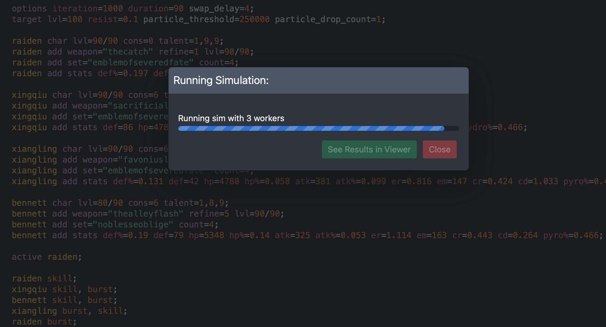
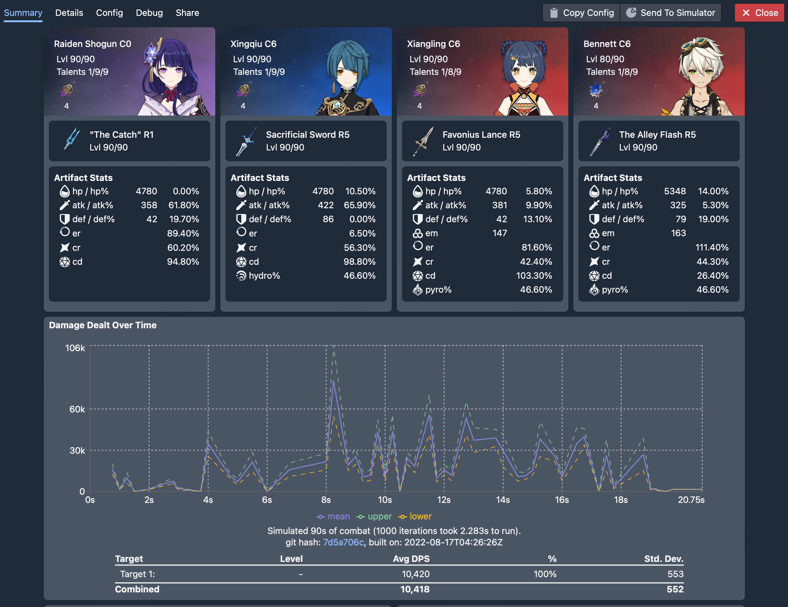
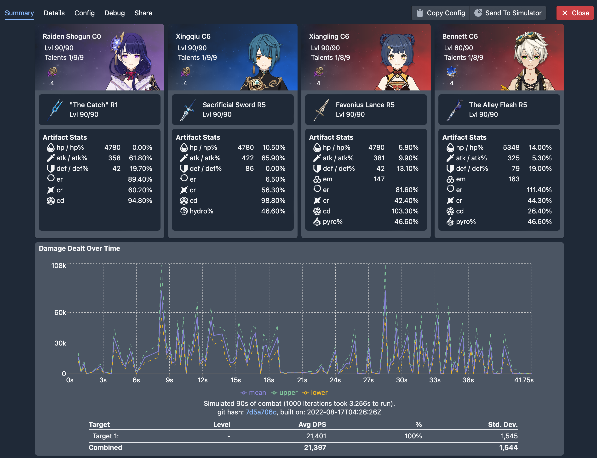
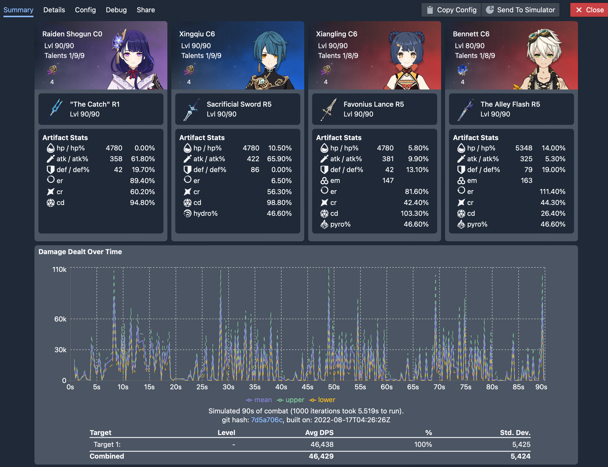
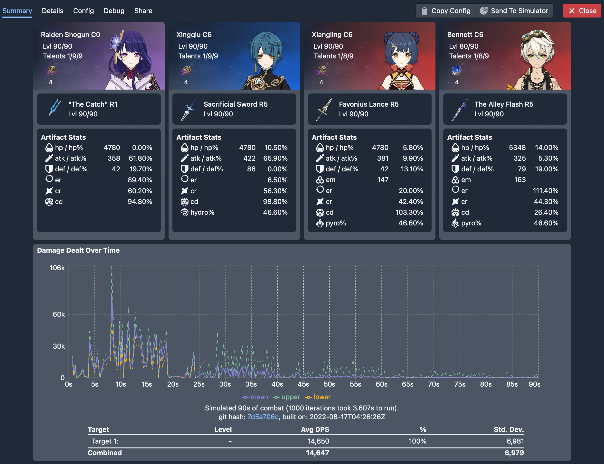
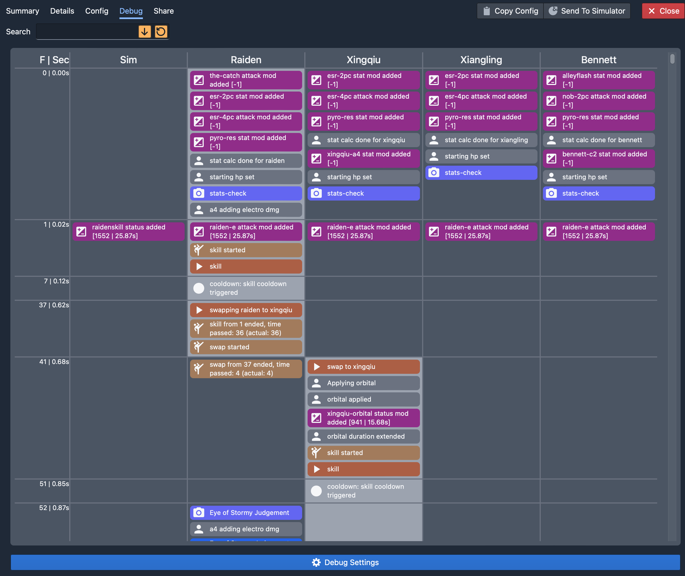
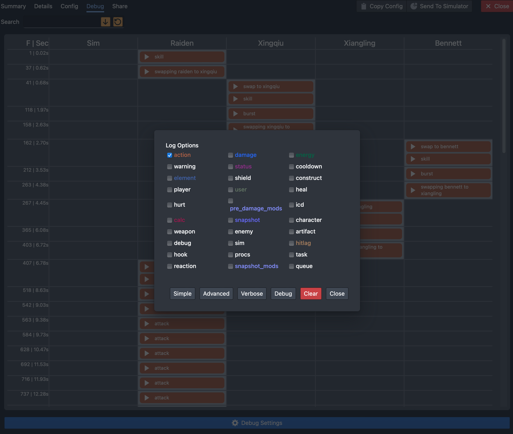

This will be a basic tutorial on how to build your own simulation from scratch. The team we'll be simulating is the ever popular Raiden/Xiangling/Xingqiu/Bennett team. Feel free to follow along with your own stats.

:::note
This tutorial is mainly targetted at users that wish to use their own stats to build a simulation. Not everything will apply to theorycrafters intending to use standardized stats. However the general concepts will still remain the same
:::

## Basic options

Let's start with some basic options

```
options iteration=1000 duration=90 swap_delay=4;
target lvl=100 resist=0.1 particle_threshold=250000 particle_drop_count=1;
```

Here we are using a `swap_delay` of 4 which corresponds to roughly 30ms ping.

Also note that we are using `particle_threshold=250000 particle_drop_count=1` to simulate the enemy dropping 1 clear particle for every 250k damage taken.

This takes care of our basic options, target, and energy needs.

## Enter some character stats

Starting by entering your character details. We imported ours from Enka Network so that's why all the stats are consolidated into one line.

Our config now looks like this

```
options iteration=1000 duration=90 swap_delay=4;
target lvl=100 resist=0.1 particle_threshold=250000 particle_drop_count=1;

raiden char lvl=90/90 cons=0 talent=1,9,9;
raiden add weapon="thecatch" refine=1 lvl=90/90;
raiden add set="emblemofseveredfate" count=4;
raiden add stats def%=0.197 def=42 hp=4780 atk=358 atk%=0.618 er=0.894 cr=0.602 cd=0.948;

xingqiu char lvl=90/90 cons=6 talent=1,9,9;
xingqiu add weapon="sacrificialsword" refine=5 lvl=90/90;
xingqiu add set="emblemofseveredfate" count=4;
xingqiu add stats def=86 hp=4780 hp%=0.105 atk=422 atk%=0.659 er=0.065 cr=0.563 cd=0.988 hydro%=0.466;

xiangling char lvl=90/90 cons=6 talent=1,8,9;
xiangling add weapon="favoniuslance" refine=5 lvl=90/90;
xiangling add set="emblemofseveredfate" count=4;
xiangling add stats def%=0.131 def=42 hp=4780 hp%=0.058 atk=381 atk%=0.099 er=0.816 em=147 cr=0.424 cd=1.033 pyro%=0.466;

bennett char lvl=80/90 cons=6 talent=1,8,9;
bennett add weapon="thealleyflash" refine=5 lvl=90/90;
bennett add set="noblesseoblige" count=4;
bennett add stats def%=0.19 def=79 hp=5348 hp%=0.14 atk=325 atk%=0.053 er=1.114 em=163 cr=0.443 cd=0.264 pyro%=0.466;
```

## The "Rotation"

At point we should have some sort of rotation in mind of what we want to simulate. For this tutorial we'll be simulating the following rotation (roughly):

1. Start with Raiden skill
1. Xingqiu uses his combo
1. Bennett uses his combo
1. Xiangling uses her combo
1. Raiden uses burst and spam normals
1. Repeat

This is by no means an optimal rotation of any sort. This is just a simple rotation that I personally actually use in game (over what is optimal)

### Set a starting character

Start by setting a starting character. In this case, we'll want to start on Raiden. We'll add the following line to the bottom of our config

```
active raiden;
```

### Enter the rotation

We'll type in our rotation exactly as described by adding in the following below the active char.

```
raiden skill;
xingqiu skill, burst;
bennett skill, burst;
xiangling burst, skill;
raiden burst;
raiden attack:15;
```

:::note
I put `raiden attack:15` after her burst for now since I'm not actually sure how many attacks she can fit into her combo just left clicking. 15 is 3 full combos which feels about right. We'll come back to this later.
:::

With this, we have a basic working config. It should look like the following:

```
options iteration=1000 duration=90 swap_delay=4;
target lvl=100 resist=0.1 particle_threshold=250000 particle_drop_count=1;

raiden char lvl=90/90 cons=0 talent=1,9,9;
raiden add weapon="thecatch" refine=1 lvl=90/90;
raiden add set="emblemofseveredfate" count=4;
raiden add stats def%=0.197 def=42 hp=4780 atk=358 atk%=0.618 er=0.894 cr=0.602 cd=0.948;

xingqiu char lvl=90/90 cons=6 talent=1,9,9;
xingqiu add weapon="sacrificialsword" refine=5 lvl=90/90;
xingqiu add set="emblemofseveredfate" count=4;
xingqiu add stats def=86 hp=4780 hp%=0.105 atk=422 atk%=0.659 er=0.065 cr=0.563 cd=0.988 hydro%=0.466;

xiangling char lvl=90/90 cons=6 talent=1,8,9;
xiangling add weapon="favoniuslance" refine=5 lvl=90/90;
xiangling add set="emblemofseveredfate" count=4;
xiangling add stats def%=0.131 def=42 hp=4780 hp%=0.058 atk=381 atk%=0.099 er=0.816 em=147 cr=0.424 cd=1.033 pyro%=0.466;

bennett char lvl=80/90 cons=6 talent=1,8,9;
bennett add weapon="thealleyflash" refine=5 lvl=90/90;
bennett add set="noblesseoblige" count=4;
bennett add stats def%=0.19 def=79 hp=5348 hp%=0.14 atk=325 atk%=0.053 er=1.114 em=163 cr=0.443 cd=0.264 pyro%=0.466;

active raiden;

raiden skill;
xingqiu skill, burst;
bennett skill, burst;
xiangling burst, skill;
raiden burst;
raiden attack:15;
```

## Our first run

Now that we have a full configuration, let's just hit the run button and see what happens:



Once the the simulation is done running, click on the See Results in Viewer button and we'll be greeted with the following screen:



So far so good, except the average DPS looks a little low. Why is that? You'll recall that in the beginning we had set the simulation last 90s but so far the rotation we entered only lasted roughly 21seconds. So we'll need to repeat the rotation however many times it takes to fill up 90s.

## Repeating the rotation

There are a couple of ways to repeat the same rotation over and over again. The simplest way is to simply copy and paste the block of actions we wish to repeat however many times we wish to repeat it. For example:

```
active raiden;

raiden skill;
xingqiu skill, burst;
bennett skill, burst;
xiangling burst, skill;
raiden burst;
raiden attack:15;

raiden skill;
xingqiu skill, burst;
bennett skill, burst;
xiangling burst, skill;
raiden burst;
raiden attack:15;
```

If we go back to the simulator (by clicking on the Simulator button in the menu), change our config to the above, and rerun it, we'll see something like this:



Looks much better already. But we're still a bit short since this only lasted roughly 40s. So we'll have to copy and paste a couple more times... or use a better option.

### A better way to repeat

Rather than copying and pasting the same block of action we wish to repeat multiple times, a better way is to just wrap the entire block in a while loop. This way if the duration of the sim changes, we don't have to adjust the number of times we copy and paste. For example:

```
active raiden:

while 1 {
  raiden skill;
  xingqiu skill, burst;
  bennett skill, burst;
  xiangling burst, skill;
  raiden burst;
  raiden attack:15;
}
```

For those of you with some familiarity in programing/scripting, you'll notice here that we're just wrapping the entire block in an infinite loop (`1` is treated as `true` here).

:::tip
If you are not familiar with programming/scripting in general, do not feel intimidated by this.

You do not need to use any scripting features (loops, variables, etc...) and can simply stick to copying and pasting the same block over and over again.
:::

With this, our config now looks like:

```
options iteration=1000 duration=90 swap_delay=4;
target lvl=100 resist=0.1 particle_threshold=250000 particle_drop_count=1;

raiden char lvl=90/90 cons=0 talent=1,9,9;
raiden add weapon="thecatch" refine=1 lvl=90/90;
raiden add set="emblemofseveredfate" count=4;
raiden add stats def%=0.197 def=42 hp=4780 atk=358 atk%=0.618 er=0.894 cr=0.602 cd=0.948;

xingqiu char lvl=90/90 cons=6 talent=1,9,9;
xingqiu add weapon="sacrificialsword" refine=5 lvl=90/90;
xingqiu add set="emblemofseveredfate" count=4;
xingqiu add stats def=86 hp=4780 hp%=0.105 atk=422 atk%=0.659 er=0.065 cr=0.563 cd=0.988 hydro%=0.466;

xiangling char lvl=90/90 cons=6 talent=1,8,9;
xiangling add weapon="favoniuslance" refine=5 lvl=90/90;
xiangling add set="emblemofseveredfate" count=4;
xiangling add stats def%=0.131 def=42 hp=4780 hp%=0.058 atk=381 atk%=0.099 er=0.816 em=147 cr=0.424 cd=1.033 pyro%=0.466;

bennett char lvl=80/90 cons=6 talent=1,8,9;
bennett add weapon="thealleyflash" refine=5 lvl=90/90;
bennett add set="noblesseoblige" count=4;
bennett add stats def%=0.19 def=79 hp=5348 hp%=0.14 atk=325 atk%=0.053 er=1.114 em=163 cr=0.443 cd=0.264 pyro%=0.466;

active raiden;

while 1 {
  raiden skill;
  xingqiu skill, burst;
  bennett skill, burst;
  xiangling burst, skill;
  raiden burst;
  raiden attack:15;
}
```

Hit run and we get...



Looking good!

:::important
If you're following along with your own stats/weapons/artifacts etc... You may find yourself with a vastly different looking graph. Most likely this has to do with energy so keep following along and we'll address that next.
:::

## Energy energy energy

One of the biggest issue first time gcsim users run into is lack of energy on their team. Often we get users coming into our discord asking why when they simulate their own team, their dps is so low. Turns out that most of the time their team is not running enough ER.

The reason why so far everything has looked good in our tutorial is because the stats we're using here is from a member of the gcsim community that has already optimized their team accordingly to have sufficient energy. To illustrate the problem a typical user would have, we're going to modify the stats a little bit.

In particular, we're going change Xiangling's ER from artifacts down to just 20%.

Before:
```
xiangling add stats
    def%=0.131 def=42 hp=4780 hp%=0.058 atk=381 atk%=0.099
    er=0.816
    em=147 cr=0.424 cd=1.033 pyro%=0.466;
```

After
```
xiangling add stats 
    def%=0.131 def=42 hp=4780 hp%=0.058 atk=381 atk%=0.099 
    er=0.2
    em=147 cr=0.424 cd=1.033 pyro%=0.466;
```

:::tip
You'll note that here we added some arbitrary line breaks to the Xiangling stats line to make it easier to read (and spot the difference).

You can always break up a single line to as many lines as you wish provide it ends in a `;`. You can make use of this to make your config more readable.
:::

So now our config looks like:

```
options iteration=1000 duration=90 swap_delay=4;
target lvl=100 resist=0.1 particle_threshold=250000 particle_drop_count=1;

raiden char lvl=90/90 cons=0 talent=1,9,9;
raiden add weapon="thecatch" refine=1 lvl=90/90;
raiden add set="emblemofseveredfate" count=4;
raiden add stats def%=0.197 def=42 hp=4780 atk=358 atk%=0.618 er=0.894 cr=0.602 cd=0.948;

xingqiu char lvl=90/90 cons=6 talent=1,9,9;
xingqiu add weapon="sacrificialsword" refine=5 lvl=90/90;
xingqiu add set="emblemofseveredfate" count=4;
xingqiu add stats def=86 hp=4780 hp%=0.105 atk=422 atk%=0.659 er=0.065 cr=0.563 cd=0.988 hydro%=0.466;

xiangling char lvl=90/90 cons=6 talent=1,8,9;
xiangling add weapon="favoniuslance" refine=5 lvl=90/90;
xiangling add set="emblemofseveredfate" count=4;
xiangling add stats 
    def%=0.131 def=42 hp=4780 hp%=0.058 atk=381 atk%=0.099 
    er=0.2
    em=147 cr=0.424 cd=1.033 pyro%=0.466;

bennett char lvl=80/90 cons=6 talent=1,8,9;
bennett add weapon="thealleyflash" refine=5 lvl=90/90;
bennett add set="noblesseoblige" count=4;
bennett add stats def%=0.19 def=79 hp=5348 hp%=0.14 atk=325 atk%=0.053 er=1.114 em=163 cr=0.443 cd=0.264 pyro%=0.466;

active raiden;

while 1 {
  raiden skill;
  xingqiu skill, burst;
  bennett skill, burst;
  xiangling burst, skill;
  raiden burst;
  raiden attack:15;
}
```

Giving this a spin and...



You'll see that the damage completely tanked and the graph looks very flat compared to the original run.

### Other ways to spot energy problem

If you recall, when the simulator runs into an action that cannot be executed because it is not ready (due to energy, cooldown, stamina etc...), it will simply stall until it can execute the action, even if it means stalling infinitely.

Because of this, one way to spot if there are energy and/or cooldown related problem is to look at the field time statistics.

### Solutions

So how do we fix this? One option is to use artifacts with more ER (most likely you should be running ER sands). However, you may not have spare ER sands available. In which case, you'll want to introduce some batterying actions. But before we can talk about how to do that, first we'll need to take a look at the debug view.


## And to debug we go

gcsim includes a very comprehensive debug view to help you see exactly what is going on in a rotation, how damage are calculated, what buffs are being applied, etc... Due to the amount of information, it can be overwhelming at first. However, you'll find that as you get more used to it, the debug view is where you will be spending most of you time when crafting a rotation.

Start by clicking on the Debug tab located towards the top left of the viewer (right above Raiden's head in our screenshot above). You'll be taken to a screen that looks something like the following:



Your view may look different than ours above, depending on the options you have ticked. So start by clicking on the Debug Settings button at the bottom of the above screenshot, and then clear everything except `action`. Your screen should look like the following:



This view is now a lot less cluttered and shows only the actions that were executed. The action executed should look familiar as it matches the rotation we had inputted.

:::info
This tutorial ends here for now. If you have any suggestions for what should be included/changed here, then feel free to talk to us on Discord (see top right).
:::
