This will be a basic tutorial on how to build your own simulation from scratch. 
The team we'll be simulating is the ever popular Raiden/Xiangling/Xingqiu/Bennett team. 

:::tip
Feel free to follow along with your own stats! Check out [this guide](/guides/importing_characters) to learn how.
:::

:::note
This tutorial is mainly targetted at users that wish to use their own stats to build a simulation. 
Not everything will apply to theorycrafters intending to use standardized stats. 
However the general concepts will still remain the same.
:::

## Basic options

Let's start with some basic options:

```
options iteration=1000 duration=90 swap_delay=4;
target lvl=100 resist=0.1 particle_threshold=250000 particle_drop_count=1;
```

Here we are using a `swap_delay` of 4 which corresponds to roughly 30ms ping.

Also note that we are using `particle_threshold=250000 particle_drop_count=1` to simulate the enemy dropping 1 clear particle for every 250k damage taken.

This takes care of our basic options, target, and energy needs.

## Enter some character stats

Starting by entering your character details. 
We imported ours from Enka Network so that's why all the stats are consolidated into one line.

Our config now looks like this:

```
options iteration=1000 duration=90 swap_delay=4;
target lvl=100 resist=0.1 particle_threshold=250000 particle_drop_count=1;

raiden char lvl=90/90 cons=0 talent=1,9,9;
raiden add weapon="thecatch" refine=1 lvl=90/90;
raiden add set="emblemofseveredfate" count=4;
raiden add stats def%=0.197 def=42 hp=4780 atk=358 atk%=0.618 er=0.894 cr=0.602 cd=0.948;

xingqiu char lvl=90/90 cons=6 talent=1,9,9;
xingqiu add weapon="sacrificialsword" refine=5 lvl=90/90;
xingqiu add set="emblemofseveredfate" count=4;
xingqiu add stats def=86 hp=4780 hp%=0.105 atk=422 atk%=0.659 er=0.065 cr=0.563 cd=0.988 hydro%=0.466;

xiangling char lvl=90/90 cons=6 talent=1,8,9;
xiangling add weapon="favoniuslance" refine=5 lvl=90/90;
xiangling add set="emblemofseveredfate" count=4;
xiangling add stats def%=0.131 def=42 hp=4780 hp%=0.058 atk=381 atk%=0.099 er=0.816 em=147 cr=0.424 cd=1.033 pyro%=0.466;

bennett char lvl=80/90 cons=6 talent=1,8,9;
bennett add weapon="thealleyflash" refine=5 lvl=90/90;
bennett add set="noblesseoblige" count=4;
bennett add stats def%=0.19 def=79 hp=5348 hp%=0.14 atk=325 atk%=0.053 er=1.114 em=163 cr=0.443 cd=0.264 pyro%=0.466;
```

## The "Rotation"

At point we should have some sort of rotation in mind of what we want to simulate. For this tutorial we'll be simulating the following rotation (roughly):

1. Start with Raiden skill
1. Xingqiu uses his combo
1. Bennett uses his combo
1. Xiangling uses her combo
1. Raiden uses burst and spam normals
1. Repeat

This is by no means an optimal rotation of any sort. 
This is just a simple rotation that I personally actually use in game (over what is optimal).

### Set a starting character

Start by setting a starting character. 
In this case, we'll want to start on Raiden. 
We'll add the following line to the bottom of our config:

```
active raiden;
```

### Enter the rotation

We'll type in our rotation exactly as described by adding in the following below the active char.

```
raiden skill;
xingqiu skill, burst;
bennett skill, burst;
xiangling burst, skill;
raiden burst;
raiden attack:15;
```

:::note
I put `raiden attack:15` after her burst for now since I'm not actually sure how many attacks she can fit into her combo just left clicking. 
15 is 3 full combos which feels about right. We'll come back to this later.
:::

With this, we have a basic working config. It should look like the following:

```
options iteration=1000 duration=90 swap_delay=4;
target lvl=100 resist=0.1 particle_threshold=250000 particle_drop_count=1;

raiden char lvl=90/90 cons=0 talent=1,9,9;
raiden add weapon="thecatch" refine=1 lvl=90/90;
raiden add set="emblemofseveredfate" count=4;
raiden add stats def%=0.197 def=42 hp=4780 atk=358 atk%=0.618 er=0.894 cr=0.602 cd=0.948;

xingqiu char lvl=90/90 cons=6 talent=1,9,9;
xingqiu add weapon="sacrificialsword" refine=5 lvl=90/90;
xingqiu add set="emblemofseveredfate" count=4;
xingqiu add stats def=86 hp=4780 hp%=0.105 atk=422 atk%=0.659 er=0.065 cr=0.563 cd=0.988 hydro%=0.466;

xiangling char lvl=90/90 cons=6 talent=1,8,9;
xiangling add weapon="favoniuslance" refine=5 lvl=90/90;
xiangling add set="emblemofseveredfate" count=4;
xiangling add stats def%=0.131 def=42 hp=4780 hp%=0.058 atk=381 atk%=0.099 er=0.816 em=147 cr=0.424 cd=1.033 pyro%=0.466;

bennett char lvl=80/90 cons=6 talent=1,8,9;
bennett add weapon="thealleyflash" refine=5 lvl=90/90;
bennett add set="noblesseoblige" count=4;
bennett add stats def%=0.19 def=79 hp=5348 hp%=0.14 atk=325 atk%=0.053 er=1.114 em=163 cr=0.443 cd=0.264 pyro%=0.466;

active raiden;

raiden skill;
xingqiu skill, burst;
bennett skill, burst;
xiangling burst, skill;
raiden burst;
raiden attack:15;
```

## Our first run

Now that we have a full configuration, let's just hit the run button and see what happens:

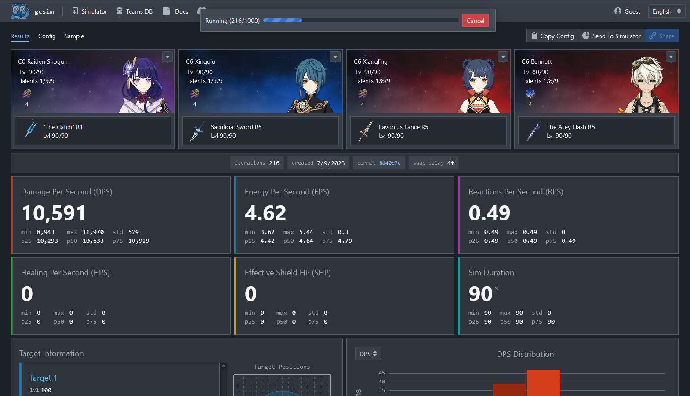

Once the the simulation is done running, we'll be greeted with the following screen:

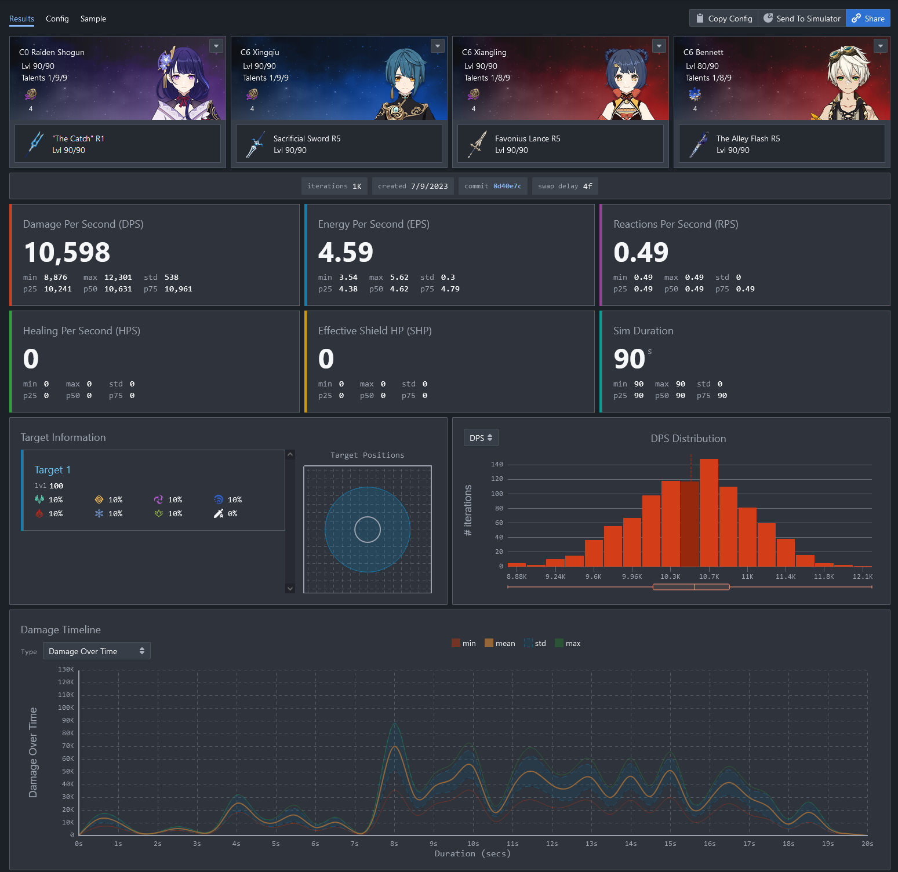

So far so good, except the average DPS looks a little low. 
Why is that? 
You'll recall that in the beginning we had set the simulation last 90 seconds but so far the rotation we entered only lasted roughly 21 seconds. 
So we'll need to repeat the rotation however many times it takes to fill up 90s.

## Repeating the rotation

There are a couple of ways to repeat the same rotation over and over again. 
The simplest way is to simply copy and paste the block of actions we wish to repeat however many times we wish to repeat it. For example:

```
active raiden;

raiden skill;
xingqiu skill, burst;
bennett skill, burst;
xiangling burst, skill;
raiden burst;
raiden attack:15;

raiden skill;
xingqiu skill, burst;
bennett skill, burst;
xiangling burst, skill;
raiden burst;
raiden attack:15;
```

If we go back to the simulator (by clicking on the Simulator button in the menu), change our config to the above, and rerun it, we'll see something like this:

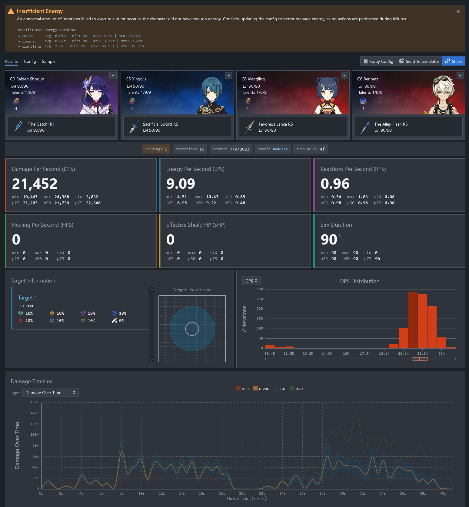

Looks much better already, but we're still a bit short since this only lasted roughly 40s. 
So we'll have to copy and paste a couple more times... or use a better option.

### A better way to repeat

Rather than copying and pasting the same block of action we wish to repeat multiple times, a better way is to just wrap the entire block in a while loop. 
This way if the duration of the sim changes, we don't have to adjust the number of times we copy and paste. 
For example:

```
active raiden:

while 1 {
  raiden skill;
  xingqiu skill, burst;
  bennett skill, burst;
  xiangling burst, skill;
  raiden burst;
  raiden attack:15;
}
```

For those of you with some familiarity in programming/scripting, you'll notice here that we're just wrapping the entire block in an infinite loop (`1` is treated as `true` here).

:::tip
If you are not familiar with programming/scripting in general, do not feel intimidated by this.

You do not need to use any scripting features (loops, variables, etc...) and can simply stick to copying and pasting the same block over and over again.
:::

With this, our config now looks like:

```
options iteration=1000 duration=90 swap_delay=4;
target lvl=100 resist=0.1 particle_threshold=250000 particle_drop_count=1;

raiden char lvl=90/90 cons=0 talent=1,9,9;
raiden add weapon="thecatch" refine=1 lvl=90/90;
raiden add set="emblemofseveredfate" count=4;
raiden add stats def%=0.197 def=42 hp=4780 atk=358 atk%=0.618 er=0.894 cr=0.602 cd=0.948;

xingqiu char lvl=90/90 cons=6 talent=1,9,9;
xingqiu add weapon="sacrificialsword" refine=5 lvl=90/90;
xingqiu add set="emblemofseveredfate" count=4;
xingqiu add stats def=86 hp=4780 hp%=0.105 atk=422 atk%=0.659 er=0.065 cr=0.563 cd=0.988 hydro%=0.466;

xiangling char lvl=90/90 cons=6 talent=1,8,9;
xiangling add weapon="favoniuslance" refine=5 lvl=90/90;
xiangling add set="emblemofseveredfate" count=4;
xiangling add stats def%=0.131 def=42 hp=4780 hp%=0.058 atk=381 atk%=0.099 er=0.816 em=147 cr=0.424 cd=1.033 pyro%=0.466;

bennett char lvl=80/90 cons=6 talent=1,8,9;
bennett add weapon="thealleyflash" refine=5 lvl=90/90;
bennett add set="noblesseoblige" count=4;
bennett add stats def%=0.19 def=79 hp=5348 hp%=0.14 atk=325 atk%=0.053 er=1.114 em=163 cr=0.443 cd=0.264 pyro%=0.466;

active raiden;

while 1 {
  raiden skill;
  xingqiu skill, burst;
  bennett skill, burst;
  xiangling burst, skill;
  raiden burst;
  raiden attack:15;
}
```

Hit run and we get...

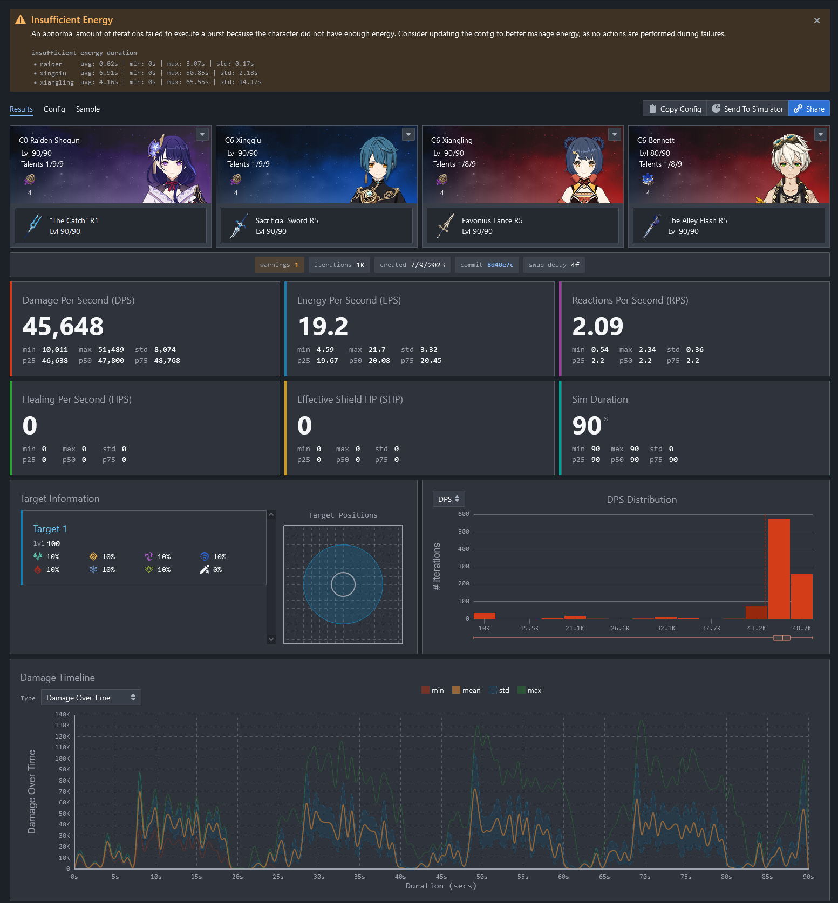

Looking good!

:::important
If you're following along with your own stats/weapons/artifacts etc. 
You may find yourself with a vastly different looking graph. 
Most likely this has to do with energy so keep following along and we'll address that next.
:::

## Energy energy energy

One of the biggest issue first time gcsim users run into is lack of energy on their team. 
Often we get users coming into our discord asking why when they simulate their own team, their dps is so low. 
Turns out that most of the time their team is not running enough ER.

The reason why so far everything has looked good in our tutorial is because the stats we're using here is from a member of the gcsim community that has already optimized their team accordingly to have sufficient energy. 
To illustrate the problem a typical user would have, we're going to modify the stats a little bit.

In particular, we're going change Xiangling's ER from artifacts down to just 20%.

Before:
```
xiangling add stats
    def%=0.131 def=42 hp=4780 hp%=0.058 atk=381 atk%=0.099
    er=0.816
    em=147 cr=0.424 cd=1.033 pyro%=0.466;
```

After:
```
xiangling add stats 
    def%=0.131 def=42 hp=4780 hp%=0.058 atk=381 atk%=0.099 
    er=0.2
    em=147 cr=0.424 cd=1.033 pyro%=0.466;
```

:::tip
You'll note that here we added some arbitrary line breaks to the Xiangling stats line to make it easier to read (and spot the difference).

You can always break up a single line to as many lines as you wish provide it ends in a `;`. You can make use of this to make your config more readable.
:::

So now our config looks like this:

```
options iteration=1000 duration=90 swap_delay=4;
target lvl=100 resist=0.1 particle_threshold=250000 particle_drop_count=1;

raiden char lvl=90/90 cons=0 talent=1,9,9;
raiden add weapon="thecatch" refine=1 lvl=90/90;
raiden add set="emblemofseveredfate" count=4;
raiden add stats def%=0.197 def=42 hp=4780 atk=358 atk%=0.618 er=0.894 cr=0.602 cd=0.948;

xingqiu char lvl=90/90 cons=6 talent=1,9,9;
xingqiu add weapon="sacrificialsword" refine=5 lvl=90/90;
xingqiu add set="emblemofseveredfate" count=4;
xingqiu add stats def=86 hp=4780 hp%=0.105 atk=422 atk%=0.659 er=0.065 cr=0.563 cd=0.988 hydro%=0.466;

xiangling char lvl=90/90 cons=6 talent=1,8,9;
xiangling add weapon="favoniuslance" refine=5 lvl=90/90;
xiangling add set="emblemofseveredfate" count=4;
xiangling add stats 
    def%=0.131 def=42 hp=4780 hp%=0.058 atk=381 atk%=0.099 
    er=0.2
    em=147 cr=0.424 cd=1.033 pyro%=0.466;

bennett char lvl=80/90 cons=6 talent=1,8,9;
bennett add weapon="thealleyflash" refine=5 lvl=90/90;
bennett add set="noblesseoblige" count=4;
bennett add stats def%=0.19 def=79 hp=5348 hp%=0.14 atk=325 atk%=0.053 er=1.114 em=163 cr=0.443 cd=0.264 pyro%=0.466;

active raiden;

while 1 {
  raiden skill;
  xingqiu skill, burst;
  bennett skill, burst;
  xiangling burst, skill;
  raiden burst;
  raiden attack:15;
}
```

Giving this a spin and...

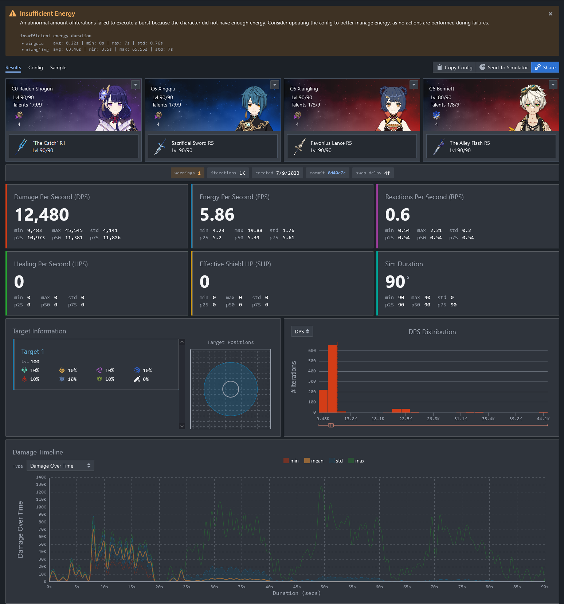

You'll see that the damage completely tanked and the graph looks very flat compared to the original run.

### Other ways to spot energy problem

If you recall, when the simulator runs into an action that cannot be executed because it is not ready (due to energy, cooldown, stamina etc.), it will simply stall until it can execute the action, even if it means stalling infinitely.

One way to spot energy issues is through the warnings. As you can see from the above screenshot, there is a warning that says "Insufficient Energy". This warning works be detecting on average how often a character failed to use their burst. Note that the detection system is still fairly new and therefore should not be the only indicator to rely upon.

### Solutions

So how do we fix this? 
One option is to use artifacts with more ER (most likely you should be running ER sands). 
However, you may not have spare ER sands available. 
In which case, you'll want to introduce some batterying actions. 
But before we can talk about how to do that, first we'll need to take a look at the sample view.

## And to Sample we go

gcsim includes a very comprehensive Sample view to help you see exactly what is going on in a rotation, how damage is calculated, what buffs are being applied, etc. 
Due to the amount of information, it can be overwhelming at first. 
However, you'll find that as you get more used to it, the Sample view is where you will be spending most of you time when crafting a rotation.

Start by clicking on the Sample tab located towards the top left of the viewer (right above Raiden in our screenshot above). 
After that, we're going to generate a sample by clicking the generate button. But before that, we're going to change the drop down from `Sample Seed` to `Min Seed`, like so:

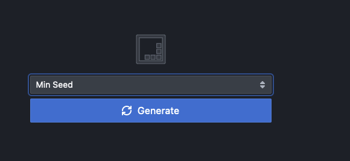

The reason for using min seed here instead of sample seed is to make the example more obvious. For your own usage, most of the time you'll be using the `Sample Seed` option.

You'll be taken to a screen that looks something like the following:


Your view may look different than ours above, depending on the options you have ticked. 
So start by clicking on the `Settings` button top right, and then clear everything except `action` and `energy`. 
Your screen should look like the following:

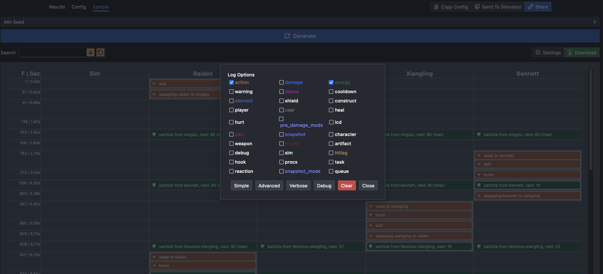

This view is now a lot less cluttered and shows only the actions that were executed and the character energy.
The action executed should look familiar as it matches the rotation we had inputted.

### How to read the sample

#### Sample table row

Each row in the sample table represent what took place in 1 single frame. On the left hand side you will see the frame represented by each row:

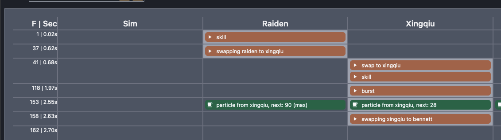

Here for example, you will see that the first row represents what happened on frame 1, the second row represents what happened on frame 37, and so on.

Notice that the table skips any frames where there are nothing logged for the particular options you are filtering for, hence the row jumps from frame 1 to frame 37. This is important to pay attention to particularly for diagnosing rotation issues. Currently we are only showing `action` and `energy`. If you were to enable more options, you'll see new rows populate.

#### Sample table column

Each column in the sample table represents a character in your sim, with the first column being a special column representing sim specific events that doesn't necessarily tie into any specific character. Thus you will always have between 2 to 5 columns.

#### Reading row by row

When just starting out, you'll want to read through the sample row by row. As you get more experienced with it you'll simply be skipping to certain rows you are interested in.

So let's take a look at the first couple of rows and see what is happening here:

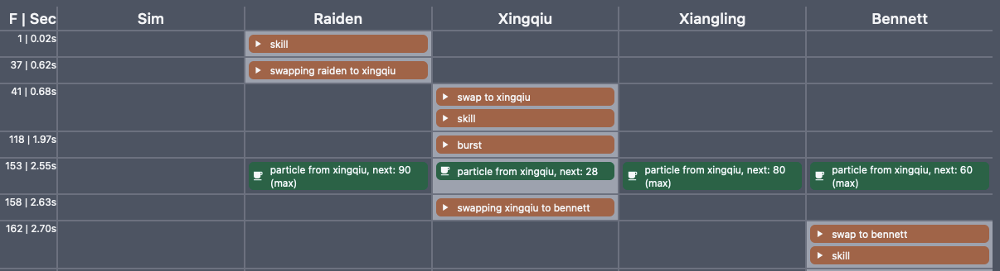

We see that:
- Raiden used skill on frame 1
- Raiden started swap to Xingqiu on frame 37
- Xingqiu comes on field on frame 41, and uses skill on the same frame
- Xingqiu uses burst on frame 118
- The team received particiles from Xingqiu's skill usage on frame 153
- Xingqiu started swap to Bennett on frame 158
- Bennett comes on field on frame 162, and uses skill on the same frame

Going back to our config:

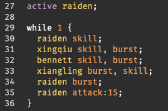

We see that this is exactly what we told the sim to do. We start with Raiden, use her skill, then use Xingqiu skill and burst, etc...

You'll see that the sim handled when the actions took place for us. We only had to tell the sim which action to use

:::caution
It's important to understand that by **default**, gcsim will execute action as fast as possible (aka frame perfect).

It is possible to delay execution via [waits](/reference/system_functions#wait), but becareful of how waits are handled (read the warning in the documentation carefully). It may not be intuitive.
:::

And that's really all there is to it when it comes to reading the sample table. Next section we'll cover some more tips and tricks.

### Sample tips and tricks

#### Getting more information

Sometimes just knowing when an action took place is not enough. Sometimes we need to get more information. For every single event in the sample table, you can click on it to get more details. For example, if we were to click on any of the energy event, we would see the following:

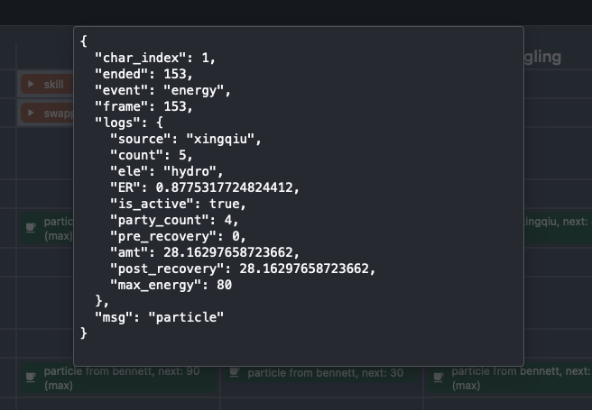

Here we get a detail log as recorded by gcsim that shows us additional information such as the number of particles, the current ER of the character receiving the particle, the amount of energy being recovered, and the amount of energy before receiving the particles, and the ending amount of energy.

#### Commonly used log options

The following are some commonly used log options and what they tell you:
- `damage`: shows when damage took place and the amount of damage
- `calc`: shows the calculation that goes into each damage instance

:::info
This section is incomplete, feel free to help contribute to this
:::

## Finding our energy problem

Let's backtrack a bit and get back to finding our energy problem. Sticking with the same sample options (i.e. only showing `action` and `energy`), if we scroll down, we'll notice that the log ends abruptly at frame 1483:

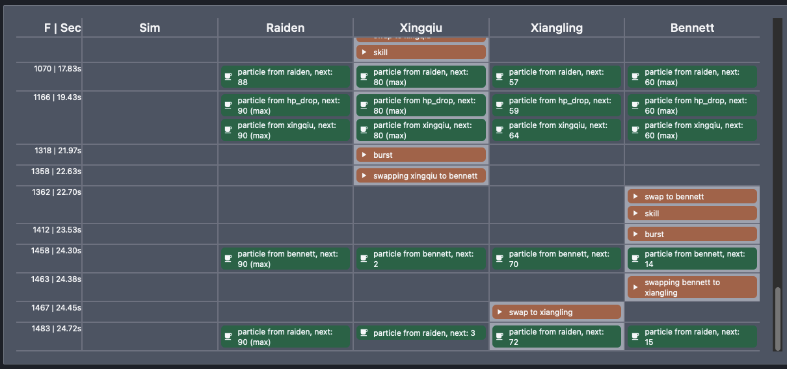

If you recall, we had asked our sim to run for 90s of combat, how come there's nothing happening after 24.72s? Looking at the sample page, we see that the last couple of actions were as follows:
- Frame 1412: Bennet used burst
- Frame 1463: Benett started swap to Xiangling
- Frame 1467: Xiangling came on field.

Let's take a look at our config again:


We can see that at this point, on frame 1467, Xiangling should be using her burst. But notice that as of frame 1458, Xiangling only have 70 energy. She doesn't have enough energy to use her burst when she came on field.

And unfortunately, with no other source of energy, for the remainder of the simulation from 24.72s onward to 90s, she never gets enough energy to use her burst. As a result, in this particular iteration, Xiangling is stuck on trying to use her burst every frame but couldn't. 

This is what is causing our dps to tank completely. 

## Batterying actions

Now that we see Xiangling is the one that's having energy problem, we'll need to find some way to charge her up. Looking at our config:


The ideal place for this is probably after Raiden's attack string before the entire thing loops again.

:::tip
Figuring out where and how to change a config is the creative process of coming up with a good rotation. This is something you will build experience for over time
:::

So let's try something like this:

```
active raiden;

while 1 {
  raiden skill;
  xingqiu skill, burst;
  bennett skill, burst;
  xiangling burst, skill;
  raiden burst;
  raiden attack:15;
  //let's swap to bennet and battery xiangling here
  bennett skill;
  xiangling attack;
}
```

Rerun the simulation and...

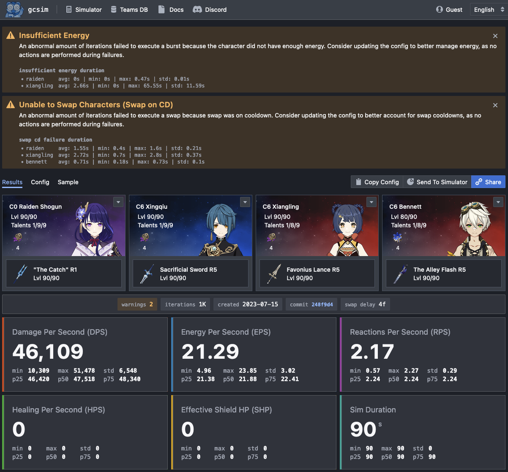

Look at that! Our DPS jumped right up.

:::tip
Notice that we now have a new warning about swap cd. The cause of this the two new actions we added. The warning is telling us that we are trying to swap to Raiden and Xiangling and in both cases the action is failing due to cd.

If you look at the actions we added, we are asking the sim to swap to Xiangling right after Bennett skill. Bennett skill does not take up enough field time for swap to come off cooldown. Hence resulting in the swap to Xiangling failing.

Similarily, we are asking the sim to swap to Raiden right after using a single Xiangling attack, which again, does not take up enough field time for swap to come off cooldown.

We can resolve this by tweaking the above batterying action a little, into something like:

```
  //let's swap to bennet and battery xiangling here
  bennett attack, attack, skill;
  xiangling attack, attack, attack;
  raiden attack;
```

This is all part of that creative rotation building process. The thought here is we want to minimize the amount of time a character sits around doing nothing, so we add extra filler actions such as Bennett normals and Xiangling normals while waiting for swap to come off cooldown.
:::

### Double check sample

Let us regenerate our `Min Seed` sample again to see if the issue is fixed. You'll notice on frame 1018 we can see the new batterying actions we added:

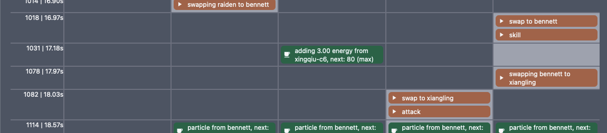

However, as we scroll down to the bottom, we see that the events still ended abruptly at frame 1483, what gives? Our dps jumped so the problem should have been fixed right?

### Understanding randomness

This actually illustrate a very important point about randomness. The DPS we see on the main page shows the **average** dps across many many trials. 

The sample screen we are looking at represents **one single trial**. In particular, when we picked `Min Seed`, we actually asked for the trial that had the **lowest dps**. Remember that there is randomness in the amount of particles generated. So in the trial with the lowest dps, we actually had really bad luck and Xiangling still don't have enough energy even after adding in a batterying action.

So let's try and fix this by adding in another batterying action, making our config look like:

```
active raiden;

while 1 {
  raiden skill;
  xingqiu skill, burst;
  bennett skill, burst;
  xiangling burst, skill;
  raiden burst;
  raiden attack:15;
  //let's swap to bennet and battery xiangling here
  bennett skill;
  xiangling attack;
  bennett skill;
  xiangling attack;
}
```

Rerun this and jumping to the `Min Seed` sample, you'll see now that that the trial with the lowest dps no longer stalls at frame 1483 and instead continues to the end of 90s.

But this came at a cost:

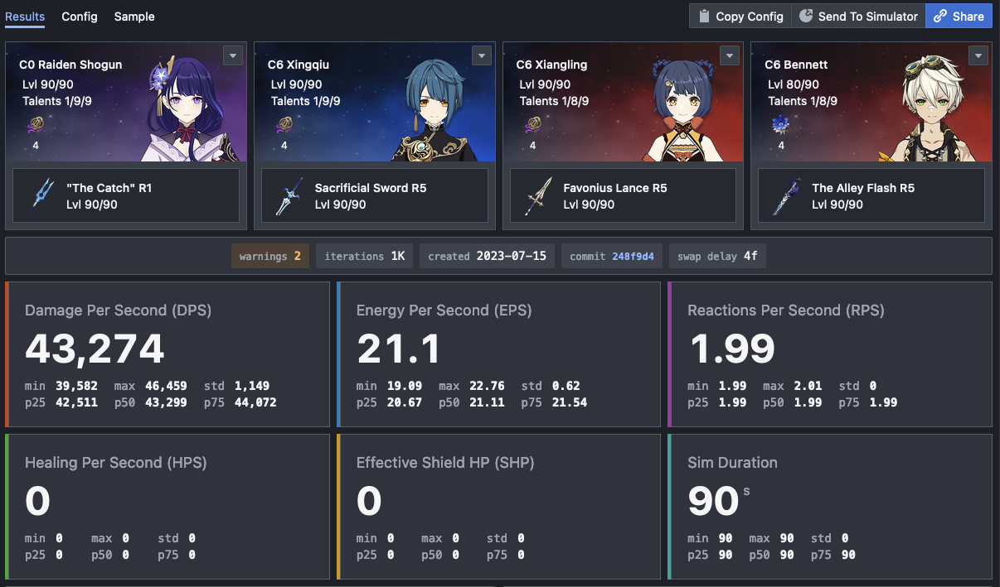

Our dps is now lower. This is the cost of the extra field time required for the 2x batterying action.

### Conditional batterying

:::info
We are not going into too much details here because this is getting more advanced. However, we still want to show that this is more realistic than the above example
:::

We showed above how we can add batterying actions. However, what we have done above is always batterying. The reality is, most players will check to see if Xiangling's burst is up (i.e. enough energy) at the end of the rotation, and only battery if she does not have enough energy. 

This can be handled in gcsim with conditionals, like so:

```
active raiden;

while 1 {
  raiden skill;
  xingqiu skill, burst;
  bennett skill, burst;
  xiangling burst, skill;
  raiden burst;
  raiden attack:15;
  //let's swap to bennet and battery xiangling here
  if .xiangling.energy < 70 {
    bennett skill;
    xiangling attack;
  }
}
```

With this, the batterying will only occur if Xiangling has less than 70 energy at the end of Raiden's attack string, making our results look slightly better as well:

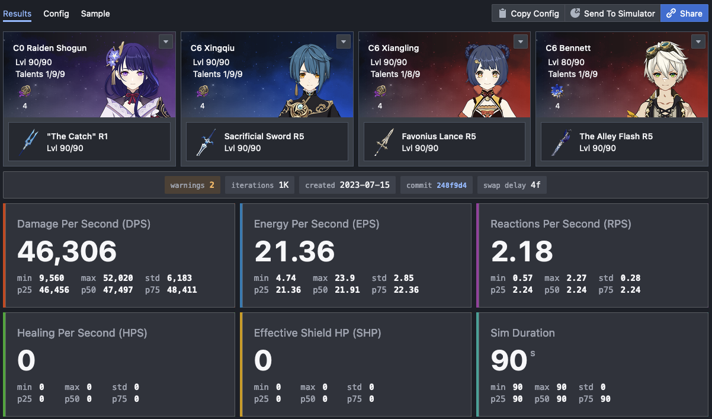

## Concluding remarks

This tutorial ends here for now. Hopefully you find this useful. If you have any suggestions for what should be included/changed here, then feel free to talk to us on Discord (see top right).
