:::info
If you want to use optimized, non-personalized artifact stats according to the KQM Standard, then please check out [this guide](/guides/substat_optimizer).
:::

You have two options to import your own characters:
- Enka.Network (Enka) - *recommended*
- Genshin Optimizer (GO)

:::info
If you want to update your imported characters for changes you have made ingame or in GO, then import and add them again.
:::

## Enka.Network (Enka)

:::caution
Make sure that your Profile ingame has the desired characters with correct weapons/artifacts on display and that `Show Character Details` is enabled. 

    
Click here to learn how!

1. Open the Paimon Menu.

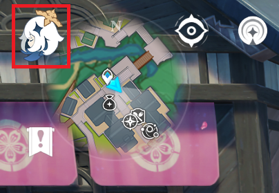

2. Click on the pencil on the top right of your namecard.

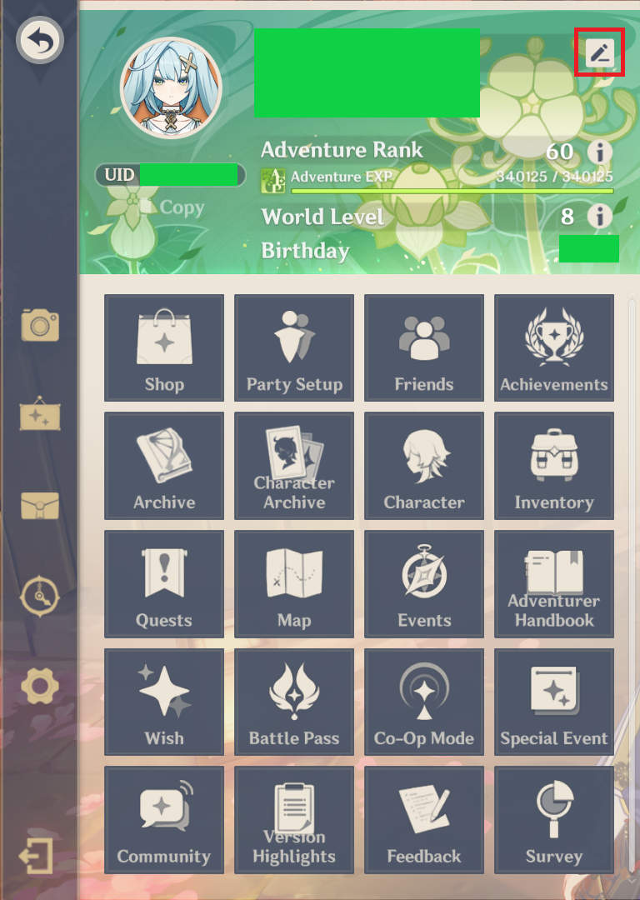

3. Click on `Edit Profile`.

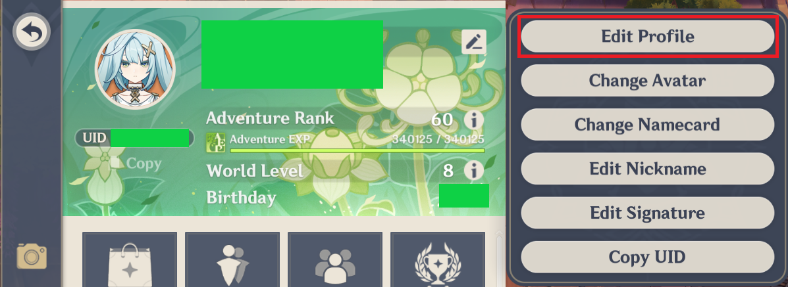

4. Check that the `Character Showcase` is showing the desired characters.
5. Check that `Show Character Details` is enabled.

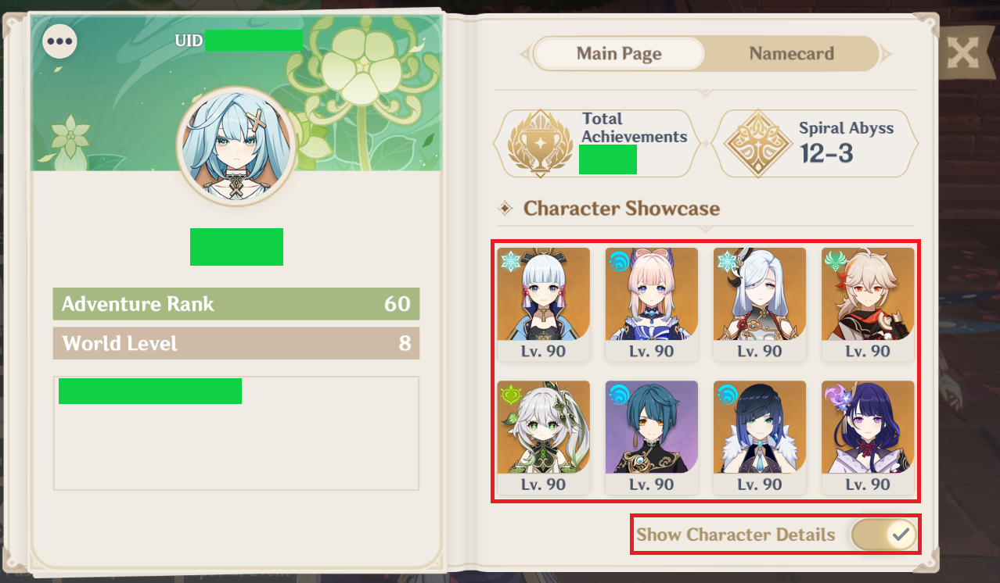

:::

1. Go the [`Simulator` page on gcsim](https://gcsim.app/simulator). 
2. Click on `Tools` at the bottom.

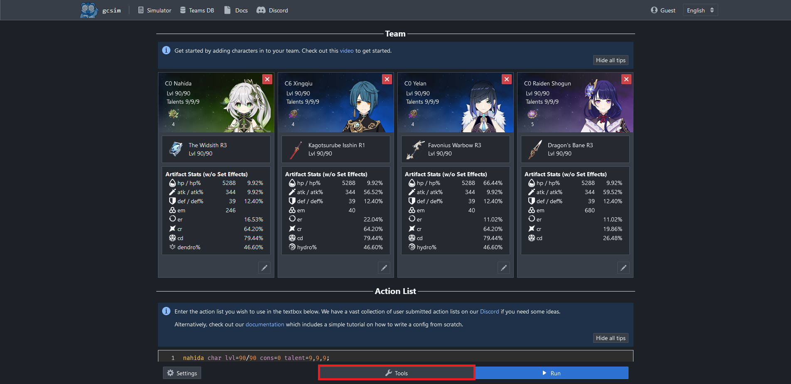

3. Click on `Import from Enka` in the `Tools` menu. This will open a Dialog.

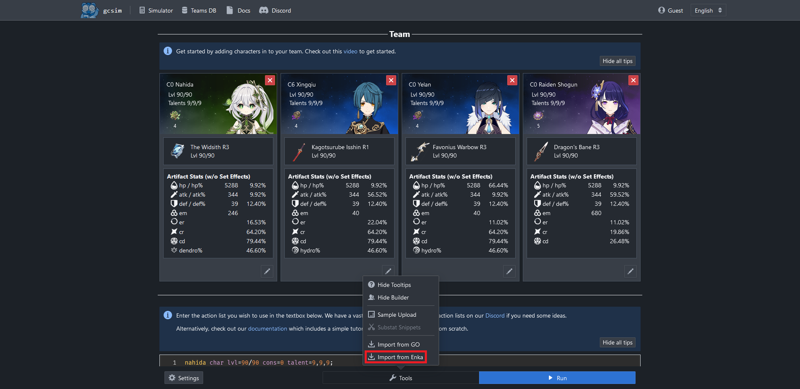

4. Paste your UID into the text box.

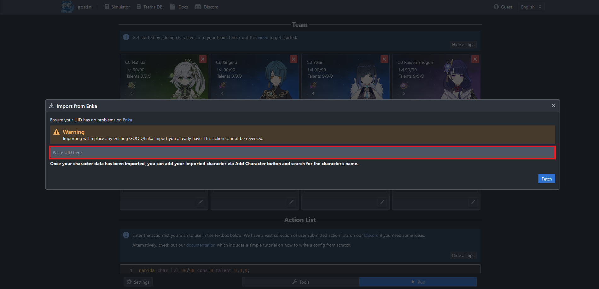

:::tip
You can obtain/copy your UID from ingame.

    
Click here to learn how!

1. Open the Paimon Menu.

2. Click in the highlighted area to copy your UID to the clipboard.

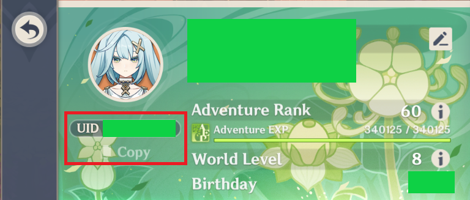

:::

5. Click on the `Fetch` button on the bottom right of the Dialog. 

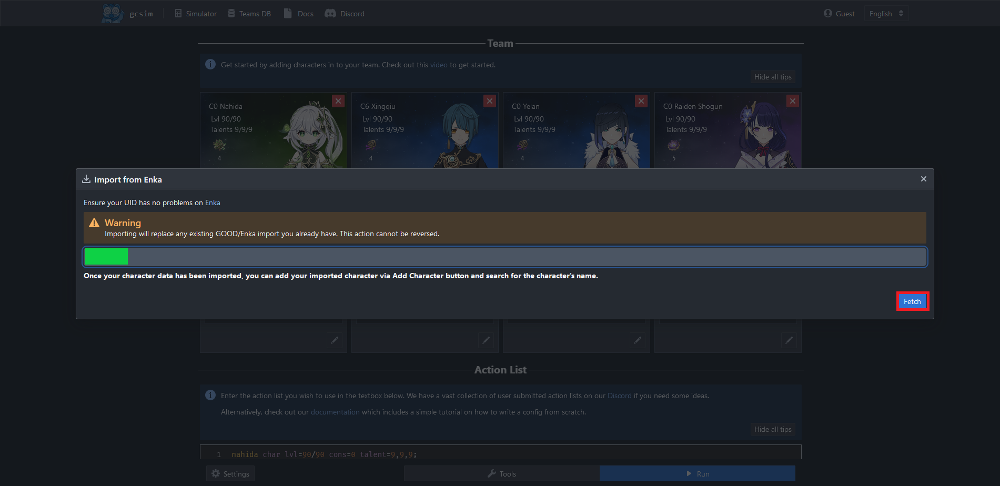

:::danger
This will overwrite any existing imports for your characters.
:::

## Genshin Optimizer (GO)

:::caution
Make sure the desired characters in GO have the correct character level/talent levels/constellation/artifacts/weapon.
:::

1. Go the [`Simulator` page on gcsim](https://gcsim.app/simulator). 
2. Click on `Tools` at the bottom.

3. Click on `Import from GO` in the `Tools` menu. This will open a Dialog.

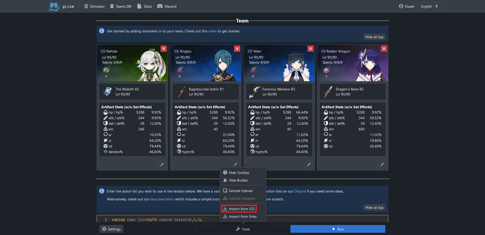

4. Go to this [GO page](https://frzyc.github.io/genshin-optimizer/#/setting).
5. Copy your GO Database to the clipboard by clicking on the `Clipboard` button.

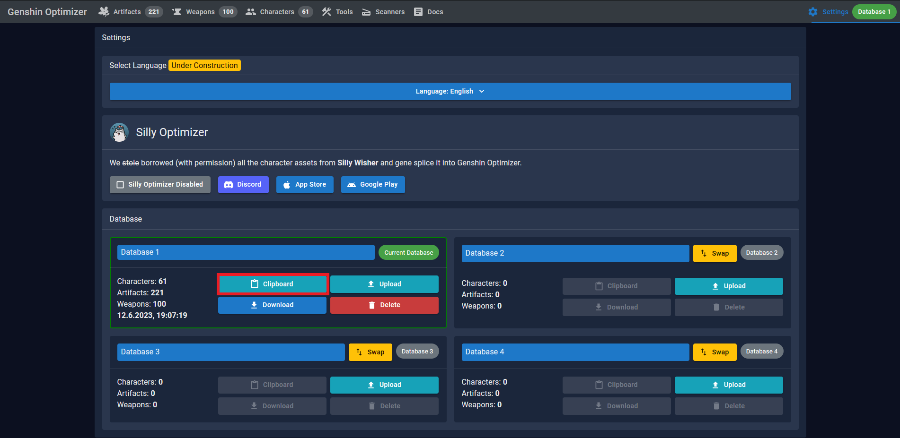

7. Go back to the [`Simulator` page on gcsim](https://gcsim.app/simulator).
8. Paste your artifact DB into the text box.

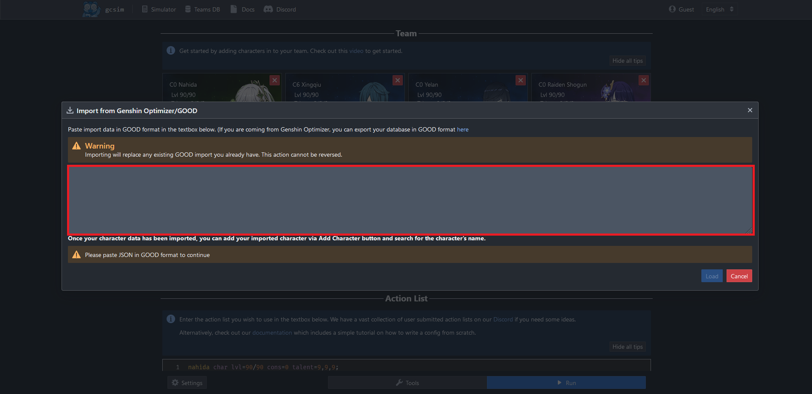

9. Click on the `Load` button on the bottom right of the Dialog.

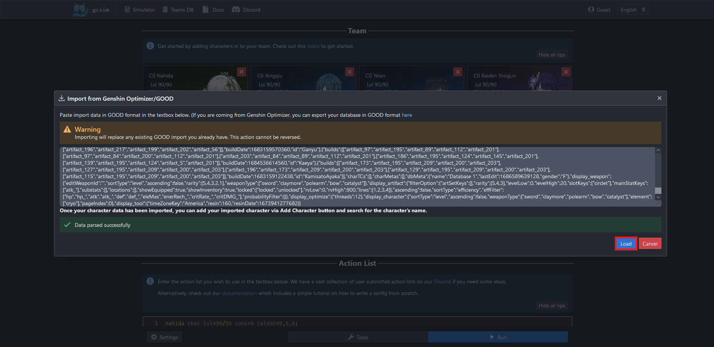

:::danger
This will overwrite any existing imports for your characters.
:::

## Add Your Own Characters To A Config

0. Import your characters via [Enka](#enkanetwork-enka) or [GO](#genshin-optimizer-go).
1. Go the [`Simulator` page on gcsim](https://gcsim.app/simulator). 

:::tip
To remove a character from the team and open up a slot, click on the ❌ at the top right of the character's card.

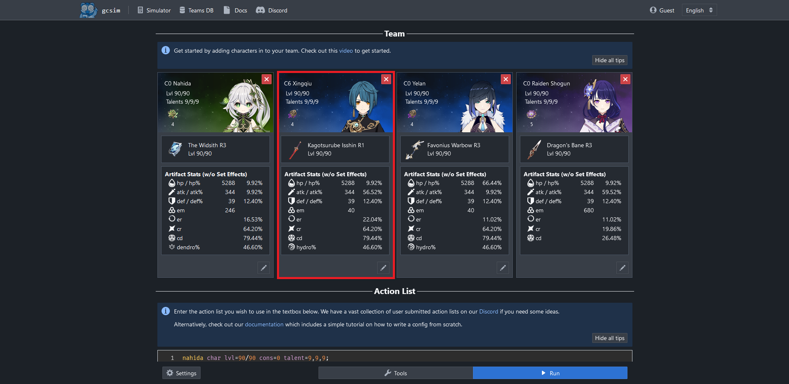
:::

2. Click on the ➕ button at the top under the `Team` heading. This requires at least one open slot on the team. 

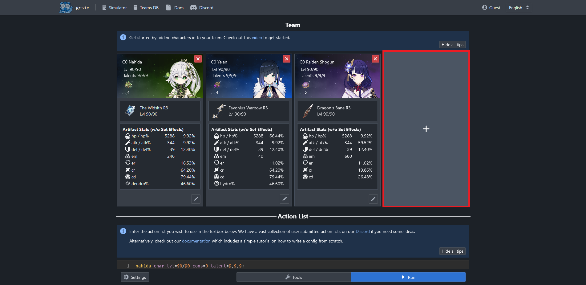

3. Start typing the name of the desired character into the search bar.

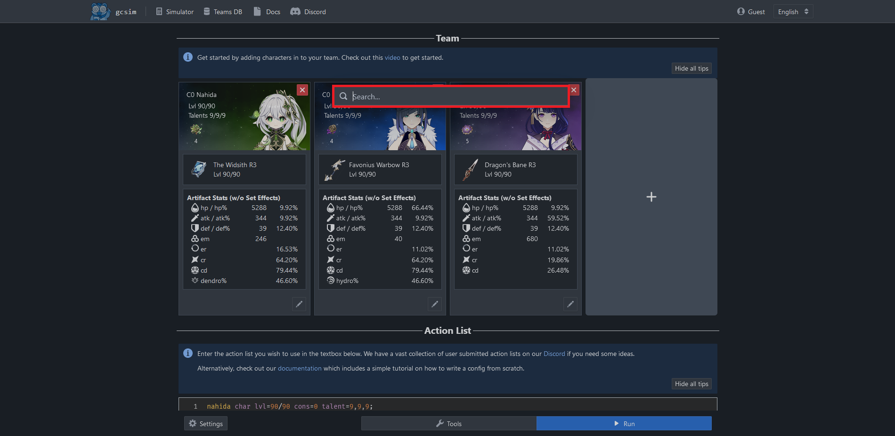

4. Click on the character that says something like `(Imported on ...)` at the end.

Result:

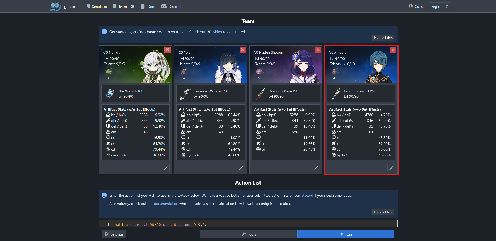

Repeat steps 1-4 for all the characters you want to add.
