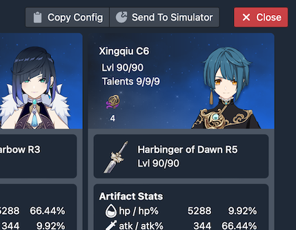
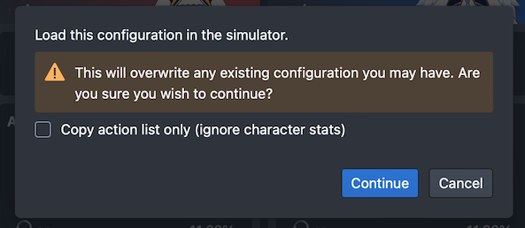

You can import the config from any shared viewer link by clicking on the Send to Simulator button located to the top right. See screenshot below:

Click on the button will pop up a dialog notifying you that this will overwrite any existing configuration you have in the simulator. This action cannot be undone so make sure you wish to overwrite.

:::tip
Note that you have the option of copying the action list only. This option is useful if you have already entered the character stats for the team you wish to use and merely want to pull in the script from another simulation.

If this option is ticked, your existing character stats will not be overwritten (this is an exception to the warning).
:::

