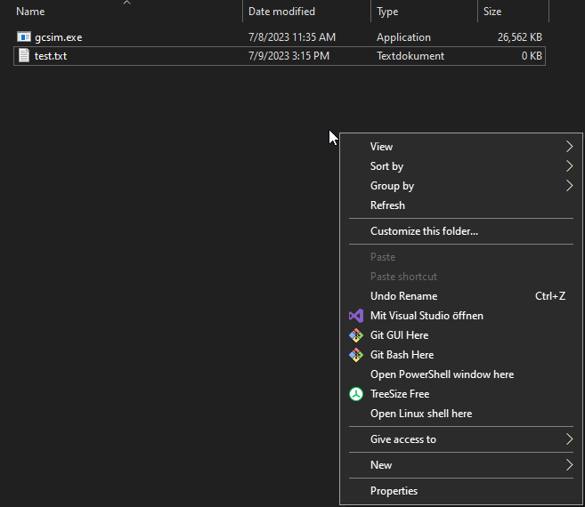

:::info
If you want to use personalized artifact stats, then please check out [this guide](/guides/importing_characters).
:::

## Introduction

Substat optimizer mode is a currently **experimental** feature that attempts to optimize your artifact substats given an action list and a few key inputs. 
This can be useful if:

1. You are doing theorycrafting work and want to align your calculations to a given set of standards.
2. You do not have your artifacts available from another source such as Genshin Optimizer and would like to generate some results with reasonable artifact presets.

Currently in practice, we have found the substat optimizer module to be roughly on par or slightly exceeding hand optimizing, and it generates results that yield team DPS within 1-5% of using a sheet to optimize substats instead. 
If you encounter any teams that yield unexpected results, please feel free to reach out to us on our Discord (see top right).

:::info
Note that by default the substat optimizer will assign substats that adhere to the KQM Standard. 
If you would like to use different assumptions, please refer to [this page](/reference/cli#additional-options-for--options).
:::

:::info
Due to difficulties in porting this into the website and performance reasons, the substat optimizer is only available via command line. 
:::

## Setup

### Assumptions

:::info
Please refer to [this guide](/guides/installation) for information on how to install the gcsim CLI.
:::

The following descriptions assume:
- Windows as the operating system
- CLI (`gcsim.exe`) and config file (`test.txt`) are in the same folder 
- config file is set up for substat optimization 

The file and folder names are just examples.

### Config

Before using the optimizer, you will need to set up your config. 

:::info
Please refer to the [introductory guide](/guides/building_a_simulation_basic_tutorial) and the [reference section](/reference) for more information on gcsim configs.
:::

:::danger
In order for the substat optimizer to work, you will need to split up the character's `add stats` lines into main stats and substats. 
This is especially relevant when adding stats via Enka Import or the Character Builder.

Example:
```
albedo add stats def%=0.831 def=39.36 hp=5287.88 hp%=0.0992 atk=344.08 atk%=0.0992 er=0.1102 em=39.64 cr=0.642 cd=0.7944 geo%=0.466;
```

This needs to be converted into a main stat and substat line like this that specifies the stats for flower, feather, sands, goblet and circlet:
```
albedo add stats hp=4780 atk=311 def%=0.518 geo%=0.466 cr=0.311; # main
albedo add stats hp%=0.0992 hp=507.88 atk%=0.0992 atk=33.08 def%=0.248 def=39.36 em=39.64 cr=0.331 cd=0.7944 er=0.1102; # subs
```

You can also leave out the substat line and let the substat optimizer generate it.
:::

## Example

:::info
Please refer to [this guide](/guides/using_cli) for more information on how to use the gcsim CLI.
:::

Open a Powershell window in the folder where `gcsim.exe` and your `test.txt` are located by holding Shift, right clicking in the empty space of the folder and left clicking `Open PowerShell window here`:



In the Powershell window, you can run the following command:
```
./gcsim.exe -c test.txt -s -substatOptimFull
```

This will: 
- overwrite the content of the config file `test.txt` to include optimized substat lines for every character
- run gcsim on the config file 
- open the "local" gcsim viewer page with the result

If you want some details about what the optimizer is doing you can look at the output generated by the command. 
You should see something like this output in Powershell:
```
2023-07-09T15:37:13.288+0200    WARN    Warning: Config found to have existing substat information Ignoring...                                                                
2023-07-09T15:37:13.289+0200    INFO    Starting ER Optimization...                                  
2023-07-09T15:37:22.439+0200    INFO    Raiden found in team comp - running secondary optimization routine...                                                     
2023-07-09T15:37:22.439+0200    INFO    Optimized ER Liquid Substats by character:
2023-07-09T15:37:22.440+0200    INFO    yelan: 0.4408, xingqiu: 0.4408, raiden: 0.551, nahida: 0.3306,
2023-07-09T15:37:33.749+0200    INFO    Calculating optimal substat distribution... 
2023-07-09T15:37:33.749+0200    INFO    yelan    
2023-07-09T15:37:33.749+0200    INFO    Final Liquid Substat Counts:
2023-07-09T15:37:33.749+0200    INFO    er: 8 cr: 5 cd: 7               
2023-07-09T15:37:33.749+0200    INFO    xingqiu                                        
2023-07-09T15:37:33.749+0200    INFO    Final Liquid Substat Counts:                   
2023-07-09T15:37:33.749+0200    INFO    er: 8 cr: 5 cd: 7                          
2023-07-09T15:37:33.749+0200    INFO    raiden                                         
2023-07-09T15:37:33.749+0200    INFO    Final Liquid Substat Counts:                 
2023-07-09T15:37:33.749+0200    INFO    er: 10 em: 4 cr: 4 cd: 2 
2023-07-09T15:37:33.749+0200    INFO    nahida          
2023-07-09T15:37:33.749+0200    INFO    Low damage contribution from substats - adding some points to ER instead                          
2023-07-09T15:37:33.749+0200    INFO    Final Liquid Substat Counts:     
2023-07-09T15:37:33.749+0200    INFO    er: 6 cr: 8 cd: 6
2023-07-09T15:37:33.749+0200    INFO    Final config substat strings:
yelan add stats def%=0.124 def=39.36 hp=507.88 hp%=0.0992 atk=33.08 atk%=0.0992 er=0.551 em=39.64 cr=0.2317 cd=0.5958;               
xingqiu add stats def%=0.124 def=39.36 hp=507.88 hp%=0.0992 atk=33.08 atk%=0.0992 er=0.551 em=39.64 cr=0.2317 cd=0.5958;                       
raiden add stats def%=0.124 def=39.36 hp=507.88 hp%=0.0992 atk=33.08 atk%=0.0992 er=0.6612 em=118.92 cr=0.1986 cd=0.2648;
nahida add stats def%=0.124 def=39.36 hp=507.88 hp%=0.0992 atk=33.08 atk%=0.0992 er=0.4408 em=39.64 cr=0.331 cd=0.5296;                   
2023-07-09T15:37:33.759+0200    INFO    Saved to the following location: test.txt   
Average duration of 91.43 seconds (min: 91.35 max: 95.48 std: 0.35)                            
Average 6556758.08 damage over 91.43 seconds, resulting in 71713 dps (min: 64840.34 max: 73727.29 std: 973.83)                         
Simulation completed 1000 iterations           
```

## Things To Consider

:::tip
Do not blindly trust the results and make sure to look at the summary stats and Sample tab to make sure that the team is performing as you would expect.
:::

:::tip
You do not have to remove existing substat `add stats` lines from your config.
The substat optimizer will automatically ignore and replace those lines.
:::

:::tip
The substat optimizer does not take very long to run (depending on the machine), but it will likely use a high amount of CPU during that time.
If you want to run it a bit more slowly and use fewer CPU cores, then you can change the `workers` number in the `options` line of the config. 
See the [config page in the reference section](/reference/config) for more information.
:::

:::tip
If you wish to rerun an optimized config after tweaking some of the substats in the config, simply run the command with the `-substatOptimFull` flag removed.
:::

:::info
The substat optimizer optimizes all stats for the characters which also includes ER requirements, so there is no need to use an ER calculator.
It usually generates conservative ER requirements that are higher than what an ER calculator sheet might suggest.

This is due to gcsim:
- having much more detailed energy mechanics than what can reasonably be modelled in an ER calculator
- modelling the actual particle rng (example: Fischl Oz) by running the config for many times
:::

:::caution
In practice, the optimizer may sometimes return that 0 ER substats is the "most optimal" if you cannot burst off cooldown.
It may also add a bigger amount of ER subs to characters which have very low damage contribution.
:::