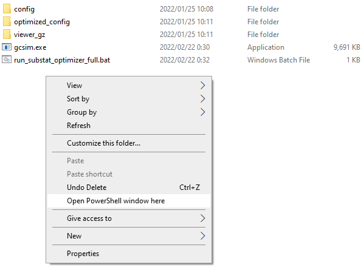

## Introduction

Substat optimizer mode is a currently **experimental** feature that attempts to optimize your artifact substats given an action list and a few key inputs. This can be useful if:

1. You are doing theorycrafting work and want to align your calculations to a given set of standards
2. You do not have your artifacts available from another source such as Genshin Optimizer and would like to generate some results with reasonable artifact presets

Currently in practice, we have found the substat optimizer module to be roughly on par or slightly exceeding hand optimizing, and it generates results that yield team DPS within 1-5% of using a sheet to optimize substats instead. If you encounter any teams that yield unexpected results, please feel free to reach out to us on our Discord.

Note that by default the substat optimizer will assign substats that adhere to the KQM Standard. If you would like to use different assumptions, please see Additional Options.

## Usage

Due to difficulties in porting this into the website and performance reasons, the substat optimizer must be operated from the command line. Below we provide a brief guide on basic usage.

Before using the optimizer, you will first need to setup your team in the UI. You will need to set up all elements for a team, so you will need:

1. A team of characters, which each have listed:
   - Level, Constellation, Talent
   - Weapon with level and refine
   - Artifact sets with main stats
   - A valid action list
2. If you have an existing configuration with substats already inserted, you do not have to remove them. The substat optimizer will automatically ignore those substat lines.
3. If you are used to sheet calcs, note that this substat optimizer also optimizes ER substats, so there is technically no need to use an ER calculator. With that being said, note that this substat optimizer may produce very unexpected results for some configurations (calc mode configs especially), if you are completely unable to meet ER requirements for a given rotation.
   - An example that we have seen in practice is that the optimizer may sometimes return that 0 ER substats is the "most optimal" if you can't burst off of cooldown.
4. As with most other things when using the sim, do not blindly trust the results and make sure to look at the summary stats and debug to make sure that the team is performing as you would expect.

Once you have this all set up, then you will want to copy out your full action list, and save it into a file.

Next, you will need to download the latest desktop version of the sim, which you can find [here](https://github.com/genshinsim/gcsim/releases/latest).

### TL;DR Just Give Me Something That Works

Below is a short Windows batch script. Copy the text into a file called `run_optimizer_full.bat` placed somewhere on your system (preferably outside of the "Program Files" folder due to Windows permissions).

```
set argument="%2"

set filename=%~1
set output=%filename:txt=json%

"gcsim.exe" -c="%cd%/config/%filename%" -substatOptim=true -out="%cd%/optimized_config/%filename%" %argument% || exit /b %errorlevel%

"gcsim.exe" -c="%cd%/optimized_config/%filename%" -out="%cd%/viewer_gz/%output%" -gz="true" %argument%
```

Next, place the `gcsim.exe` file that you downloaded from the release page in the same folder with the batch file that you created earlier.

Create three subfolders named "config", "optimized_config", and "viewer_gz", and place the config that you saved into the "config" folder.

Finally, open up a Powershell window at the location, which you can do by holding shift and right clicking in the empty space in the folder. This is what my final folder setup looks like:



In the Powershell window, you can run the following command:

```
.\run_optimizer_full.bat "[[NAME OF CONFIG]]"
```

Example:

```
.\run_optimizer_full.bat "raiden_hyper.txt"
```

This will output a configuration with optimized substats into the "optimized_config" folder, and a viewer_gz file using the optimized substats in the "viewer_gz" folder, which you can upload to the [online viewer](https://gcsim.app/viewer). If you want some details about what the optimizer is doing, you can scroll back in the cmd log, where you should see something like this output:

```
PS C:\HOME\Misc Programs\gsim\test_optim> .\run_substat_optimizer_full.bat "hu_tao_geo.txt"

C:\HOME\Misc Programs\gsim\test_optim>set argument=""

C:\HOME\Misc Programs\gsim\test_optim>set filename=hu_tao_geo.txt

C:\HOME\Misc Programs\gsim\test_optim>set output=hu_tao_geo.json

C:\HOME\Misc Programs\gsim\test_optim>"gcsim-x86_64-pc-windows-msvc.exe.lnk" -c="C:\HOME\Misc Programs\gsim\test_optim/config/hu_tao_geo.txt" -substatOptim=true -out="C:\HOME\Misc Programs\gsim\test_optim/optimized_config/hu_tao_geo.txt" ""   || exit /b 0
2022-01-25T08:49:15.286-0500    WARN    Warning: Config found to have existing substat information. Ignoring...
2022-01-25T08:49:15.287-0500    INFO    Starting ER Optimization...
2022-01-25T08:49:24.319-0500    INFO    Optimized ER Liquid Substats by character:
2022-01-25T08:49:24.319-0500    INFO    albedo: 0.2204, hutao: 0, xingqiu: 0, zhongli: 0,
2022-01-25T08:49:24.319-0500    INFO    Calculating optimal substat distribution...
2022-01-25T08:49:24.683-0500    INFO    albedo
2022-01-25T08:49:26.158-0500    INFO    Final Liquid Substat Counts: er: 4 cr: 7 cd: 9
2022-01-25T08:49:26.158-0500    INFO    hutao
2022-01-25T08:49:28.081-0500    INFO    Final Liquid Substat Counts: hp%: 2 cr: 8 cd: 10
2022-01-25T08:49:28.081-0500    INFO    xingqiu
2022-01-25T08:49:29.577-0500    INFO    Final Liquid Substat Counts: atk%: 2 cr: 8 cd: 10
2022-01-25T08:49:29.577-0500    INFO    zhongli
2022-01-25T08:49:31.134-0500    INFO    Low damage contribution from substats - adding some points to ER instead
2022-01-25T08:49:31.134-0500    INFO    Final Liquid Substat Counts: atk%: 8 er: 4 cr: 8
2022-01-25T08:49:31.134-0500    INFO    Final config substat strings:
albedo add stats def%=0.124 def=39.36 hp=507.88 hp%=0.0992 atk=33.08 atk%=0.0992 er=0.3306 em=39.64 cr=0.2979 cd=0.7282;
hutao add stats def%=0.124 def=39.36 hp=507.88 hp%=0.1984 atk=33.08 atk%=0.0992 er=0.1102 em=39.64 cr=0.331 cd=0.7944;
xingqiu add stats def%=0.124 def=39.36 hp=507.88 hp%=0.0992 atk=33.08 atk%=0.1984 er=0.1102 em=39.64 cr=0.331 cd=0.7944;
zhongli add stats def%=0.124 def=39.36 hp=507.88 hp%=0.0992 atk=33.08 atk%=0.496 er=0.3306 em=39.64 cr=0.331 cd=0.1324;
2022-01-25T08:49:31.138-0500    INFO    Saved to the following location: C:\HOME\Misc Programs\gsim\test_optim/optimized_config/hu_tao_geo.txt
```

### Details on Rolling Your Own Solution

The assumption in this section is that you know how to navigate around the command line some and want to perhaps change the provided batch file to customize it for your own needs. We will go through just a few relevant details:

First here are a few key points about the arguments to the optimizer run command (copied below):

```
gcsim.exe -c="[[PATH TO SAVED CONFIG HERE]]" -substatOptim=true -out="[[PATH TO DESIRED OUTPUT CONFIG HERE]]" [[ANY OTHER ARGUMENTS HERE]]
```

1. The `-out` flag is a convenience measure which outputs a new copy of the configuration file at the specified location without any of the existing substat lines, and has the final optimized substat lines instead.
2. Some configurations will require additional arguments - you can view a full set of flags with `gcsim.exe -help`, but the most common one that you may need to add is `-calc` if you are using a calc mode configuration.

After you run the above command, the routine will need to run for a while before returning an output. On my somewhat beefy machine it takes around 15-30 seconds depending on the configuration, but note that it will likely use a high amount of CPU over that period. If you want it to run a bit more slowly and use fewer CPU cores, then you can change the "workers" number in the `options` line at the top of the config directly, like so:

```
options iteration=500 duration=24 mode=sl workers=4;
```

### Additional Options

By default the optimizer will return KQM Standard optimized substats, but if you are interested in doing something different then you can set some semi-colon additional options in the `-options` flag, which are:

1. `total_liquid_substats` (default = 20): Total liquid substats available to be assigned across all substats
2. `indiv_liquid_cap` (default = 10): Total liquid substats that can be assigned to a single substat
3. `fixed_substats_count` (default = 2): Amount of fixed substats that are assigned to all substats
4. `sim_iter` (default = 350): RECOMMENDED TO NOT TOUCH. Number of iterations used when optimizing. Only change (increase) this if you are working with a team with extremely high standard deviation (>25% of mean)
5. `tol_mean` (default = 0.015): RECOMMENDED TO NOT TOUCH. Tolerance of changes in DPS mean used in ER optimization
6. `tol_sd` (default = 0.33): RECOMMENDED TO NOT TOUCH. Tolerance of changes in DPS SD used in ER optimization

An example if you wanted to modify the batch command would look something like this:

```
gcsim-x86_64-pc-windows-msvc.exe -c="[[PATH TO SAVED CONFIG HERE]]" -substatOptim=true -out="[[PATH TO DESIRED OUTPUT CONFIG HERE]]" "-options=total_liquid_substats=10;fixed_substats_count=4"
```
