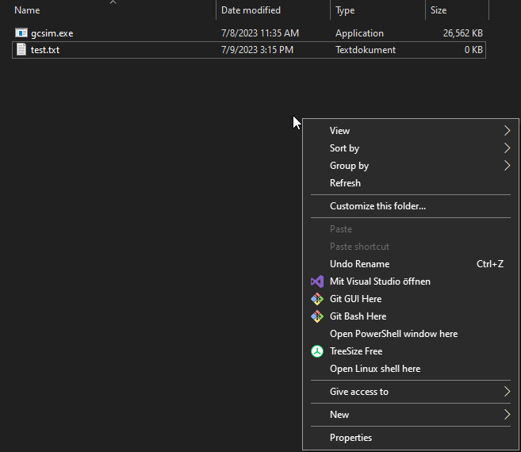

:::info
Please refer to [this guide](/guides/installation) for information on how to install the gcsim CLI.
:::

This guide will show you how use the gcsim [CLI](https://en.wikipedia.org/wiki/Command-line_interface) to execute a gcsim config.

## Setup

### Assumptions

The following descriptions assume:
- Windows as the operating system
- CLI (`gcsim.exe`) and config file (`test.txt`) are in the same folder (`genshinsim`)
- config file is set up for substat optimization 

The file and folder names are just examples.

### Folder Structure

Your initial folder structure should look like this:
```
└── genshinsim
    ├── gcsim.exe
    └── test.txt
```

## Cheatsheet

:::info
A full list of possible CLI options is available [here](/reference/cli).
:::

This assumes the folder structure from the [Setup section](#setup) and that you have Powershell opened in that folder.

### Run Config Normally
```
./gcsim.exe -c test.txt -s
```

### Run Config with Substat Optimizer

:::info
For more information on substat optimization, please refer to [this guide](/guides/substat_optimizer).
:::

```
./gcsim.exe -c test.txt -s -substatOptimFull
```

## Example

Open a Powershell window in the folder where `gcsim.exe` and your `test.txt` are located by holding Shift, right clicking in the empty space of the folder and left clicking `Open PowerShell window here`:



In the Powershell window, you can run the following command:
```
./gcsim.exe -c test.txt -s
```

This will: 
- run gcsim on the config file 
- open the "local" gcsim viewer page with the result

You should see something like this output in Powershell:
```
Average duration of 91.43 seconds (min: 91.35 max: 95.48 std: 0.35)                            
Average 6556758.08 damage over 91.43 seconds, resulting in 71713 dps (min: 64840.34 max: 73727.29 std: 973.83)                         
Simulation completed 1000 iterations           
```
