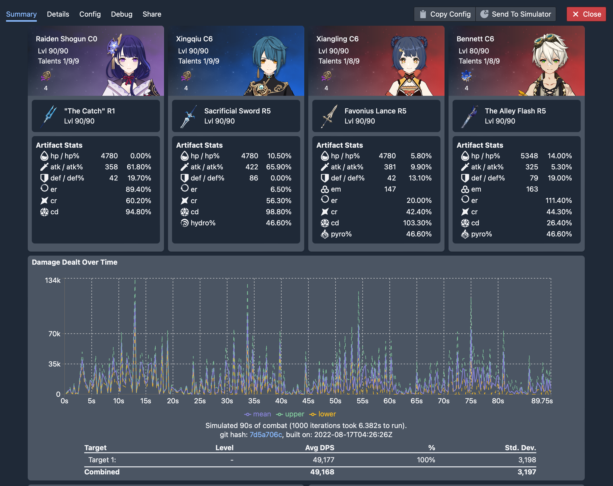

# Introduction

gcsim is a team dps calculation / combat simulation tool for Genshin Impact. gcsim simulates combat based on user inputs for any given team and calculates the overall damage dealt by that team, along with many other additional useful statistics, including:

- Overall damage distribution by character
- Detailed damage distribution for each character by skill
- Energy regeneration
- Reaction count
- Field damage

:::info
Note that gcsim is still heavily under active development. We are constantly working refining our knowledge of game mechanics and doing our best to model the game mechanics as accurately as possible. Currently, we believe that the sim is in a useable state for many teams.
:::

That being said, as with any calculations work, you should always make sure to check your results. If you do have any questions or find any issues, please either submit an issue on [Github](https://github.com/genshinsim/gcsim) or reach out to us on Discord.
