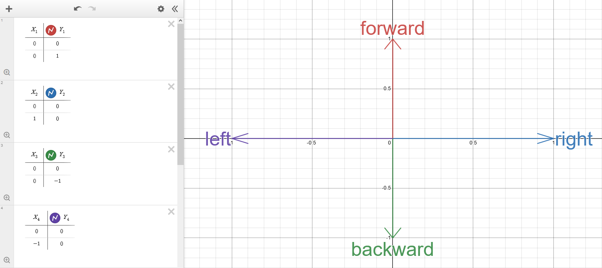
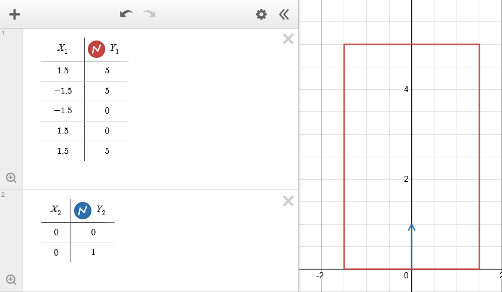
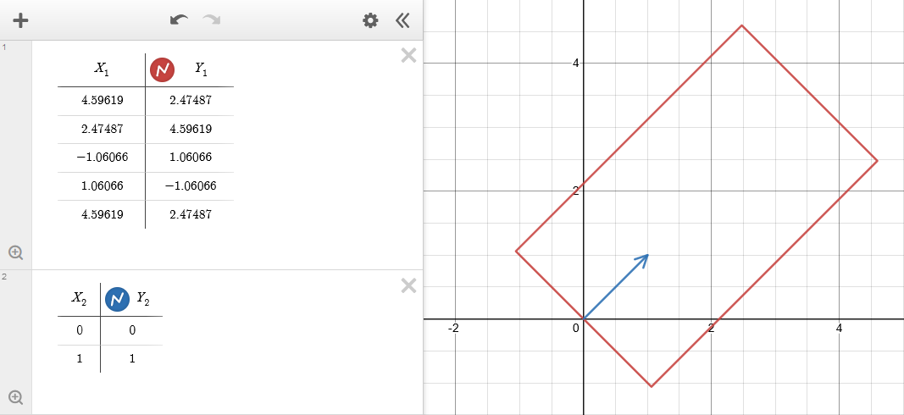

Area of Effect (AoE) is:
- a property of attacks that determines in what area it can hit targets ([hitbox](https://en.wiktionary.org/wiki/hitbox)).
- a property of targets that determines in what area it counts attacks as hitting it ([hurtbox](https://en.wiktionary.org/wiki/hurtbox)).
- a property of abilities that determines in what area it detects targets (Example: Bennett Inspiration Field).

## Coordinate system

gcsim is using a 2D coordinate system that follows the [Cartesian coordinate system](https://en.wikipedia.org/wiki/Cartesian_coordinate_system). 
That means every point in space can be uniquely identified by a combination of its x and y coordinate values.

:::caution
gcsim uses meters (m) as its [unit of length](https://en.wikipedia.org/wiki/Unit_of_length).
:::

:::tip
Some abyss floors have tiles. For example: Floor 7 and 8. These tiles have a size of 2.55m x 2.55m.
:::

## Direction

gcsim represents the (viewing) direction of the player and shapes by using [vectors](https://en.wikipedia.org/wiki/Euclidean_vector). 
Shapes are oriented according to the direction starting from their center.

:::info
Usually, the direction of a shape is based on the direction of the player.
The player direction is always set to the direction of the closest enemy (primary target).
In order to achieve this, it updates on the following events:
- player is moved
- enemy is moved
- primary target dies
:::

Each (x, y) vector can be mapped to a certain angle.

:::info
Example directions and their mappings:

| Direction | Angle | Description |
| --- | --- | --- |
| (0, 1) | 0° | "looking forward", default direction |
| (1, 0) | 90° | "looking to the right" |
| (0, -1) | 180° | "looking backward" |
| (-1, 0) | 270° | "looking to the left" |

:::

:::info
Example for a 3m x 5m rectangle with the center at (0, 0) and a direction of (1, 1) (45°):

Before rotation by direction:

After rotation by direction:

For some manual rotation calculations for shapes that have their center at (0, 0), you can use [this website](https://keisan.casio.com/exec/system/1223522781).
:::

## Hitbox, hurtbox and detection area

The AoE of an attack ([hitbox](https://en.wiktionary.org/wiki/hitbox)) and AoE of a target ([hurtbox](https://en.wiktionary.org/wiki/hurtbox)) is represented by their shape in combination with a direction. 

:::info
The player has a Circle hurtbox with 0.3m radius.
:::

:::info
Targets have a Circle hurtbox with 1m radius by default. See the [config page in the reference section](/reference/config#add-enemies) for information on how to customize the radius.
:::

In the case of a detection area, only the center point of the [hurtbox](https://en.wiktionary.org/wiki/hurtbox) matters and it has to be in that detection area.

## Shape

Here is a list of shapes that is used in gcsim:

| Shape | Description | Attributes |
| --- | --- | --- |
| SingleTarget | This means the attack is hitting a single enemy directly. | `Enemy Key` |
| Circle | A circle with a certain radius. If the circle has a fan angle, then it becomes a [circular segment](https://en.wikipedia.org/wiki/Circular_segment). | `Center`, `Offset X`, `Offset Y`, `Radius`, `Fan Angle` |
| Box | A 2D box (rectangle) with a certain width and length. | `Center`, `Offset X`, `Offset Y`, `Box X` (width), `Box Y` (length) |

:::caution
gcsim is implemented entirely in 2D, but Genshin is a 3D game. 
This means we have the following mappings between 3D and 2D shapes:

| 3D shape | 2D representation |
| --- | --- |
| Sphere | Circle with same radius. |
| Cylinder | Circle with same radius. |
| Box | Rectangle with same width and length. |
:::

### Center

Every shape except for SingleTarget has a point that defines its center.

:::info
Usually, it is the position of the player or an enemy.
:::

:::caution
While circles and circular segments in gcsim have the usual center definition, rectangles have their center not in their geometric center, but in the middle of the lower side defined by the `Box X` parameter.
:::

### Offset

The center point of every shape can be shifted by a certain amount in the x direction (`Offset X`) and/or y direction (`Offset Y`).
The values for `Offset X` and `Offset Y` assume a direction of (0, 1) (0°), so they get rotated to match the shape's direction.

:::info
Most attacks do not have `Offset X`, but they usually have `Offset Y`.
:::

### Fan angle

The fan angle of a circle describes a [circular segment](https://en.wikipedia.org/wiki/Circular_segment).
It is a value between 0° (single line) and 360° (full circle).
As the value increases, the Circular segment expands 1:1 counterclockwise and clockwise beginning from the circle's direction. 

## Collision

gcsim performs [collision detection](https://en.wikipedia.org/wiki/Collision_detection) between the attack's hitbox and target's hurtbox.
If gcsim detected a collision, then the attack hits the target.
For more details, please refer to the [gcsim source code](https://github.com/genshinsim/gcsim).

## Where to find AoE data 

- [gcsim source code](https://github.com/genshinsim/gcsim)
- [reference section in these docs](/reference)
- [wiki page for AoE](https://genshin-impact.fandom.com/wiki/Area_of_Effect)
- [this sheet](https://docs.google.com/spreadsheets/d/1jqlG958K3yz22pOvYAYke-7DEezxc9GDl8G0W13NmTQ/edit?usp=sharing)
