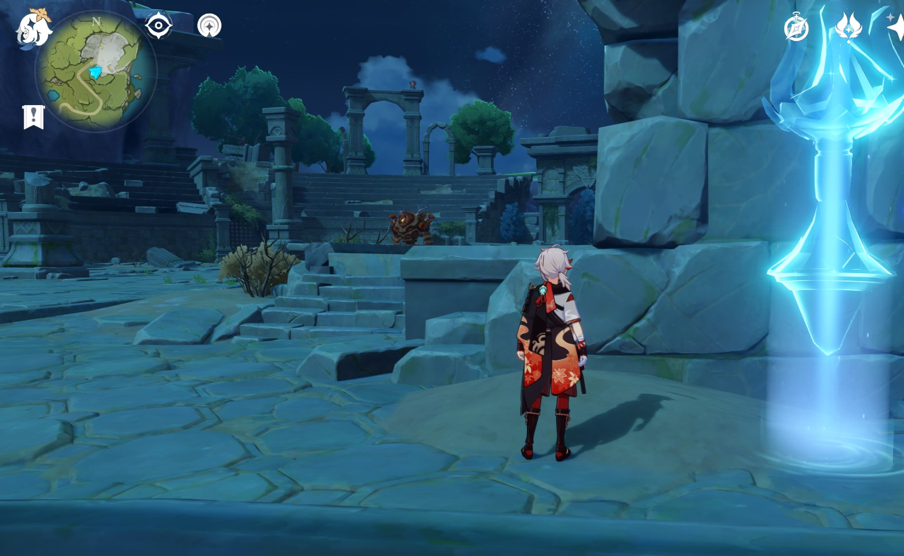
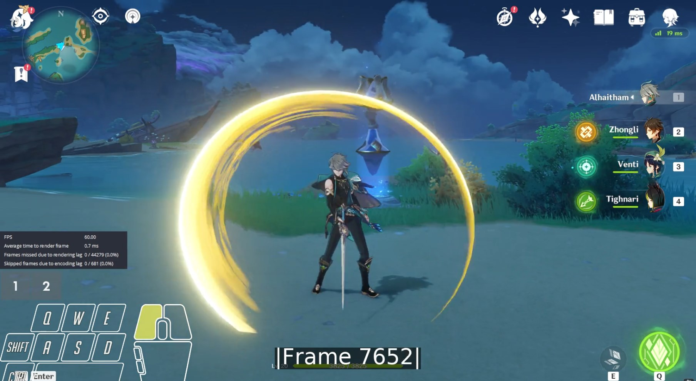
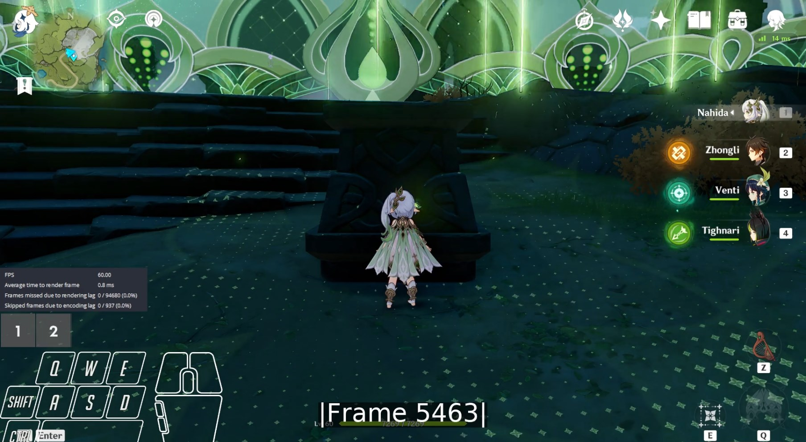

This page will tell you all about how the frames for every character are determined for gcsim.

## Assumptions

The following descriptions assume:
- Windows as the operating system.
- Computer specs are good enough to record without significant frame drops.
- Computer supports virtualization for WSL.
- Access to the character ingame.
- Top level folder for all character videos is called `genshin-frames`.
- OBS install folder is `C:\Program Files\obs-studio`.

The file and folder names are just examples.

## Setup

### Prepare Genshin

1. Open Genshin.
2. Open the Paimon Menu.
3. Open the Settings.
4. Go to the Graphics tab.
5. Only if you do not have a second monitor: Set the Display Mode to use a windowed resolution so that you can later [add OBS stats](#add-obs-stats).
6. Set everything to lowest if it is not possible to record without significant frame drops.
7. Make sure that FPS is set to 60.

### Install Video Player (mpv)

For the purposes of character frames, a video player should be able to:
- step frame-by-frame in both the forward and backward direction to [count frames](#count-frames).
- show chapter markers to make it easier to extract timestamps to put in the [YouTube description](#add-video-timestamps-to-todo-list) of the video.

A suitable video player that is able to do both of these things is [mpv](https://mpv.io/).
mpv is a free, open source and cross-platform video player.

1. Download the mpv archive for Windows from [here](https://sourceforge.net/projects/mpv-player-windows/files/latest/download).
2. Create a folder that will contain the mpv video player. In this example, it is called `mpv` as well.
3. Extract the content of the mpv archive into the `mpv` folder.

The current folder structure for `mpv` should look like this:

```
└── mpv
    ├── updater.bat
    └── updater.ps1
```

4. Open `updater.bat`.
5. Let the installer run through or answer the shown questions for customization.

After the default installation, the folder structure for `mpv` should look like this:

```
└── mpv
    ├── 7z
	│	└── ...
	├── doc
	│	└── ...
	├── installer
	│	└── ...
	├── mpv
	│	└── ...
	├── d3dcompiler_43.dll
	├── mpv.com
	├── mpv.exe
	├── settings.xml
    └── updater.bat
```

#### Set mpv As Default Video Player for .mp4 Files

1. Find a .mp4 file.
2. Right-click on the .mp4 file.
3. Click on `Open With` > `Choose another app`.
4. Click on `mpv` in the shown list.
5. Check the `Always use this app to open .mp4 files` option towards the bottom.
6. Click on `OK` at the bottom.

Now every .mp4 file will always be opened in `mpv`.

### Install Recording Software (OBS)

[Open Broadcaster Software (OBS)](https://obsproject.com/) is a free, open-source recording software available for Windows, macOS and Linux. 
Download and install the latest version of OBS from [here](https://obsproject.com/download).

#### Import Profile

1. Download a basic profile for OBS from [here](frames-profile.gz).
This profile sets the recording quality to a fairly high level (1920x1080 resolution, 60 fps, 2500 Kbps bitrate).

:::info
Feel free to lower the resolution or bitrate to save disk space and lower the computer's load as long as the needed frames can still be counted.
:::

2. Extract the `frames-profile` folder inside of the `frames-profile.gz` archive to a place where it can be found again.
3. Open OBS if not already opened.
4. Click on `Profile` in OBS's top menu.
5. Click on `Import` in the `Profile` menu.
6. Select the `frames-profile` folder and open it.

#### Select Profile

1. Open OBS if not already opened.
2. Click on `Profile` in OBS's top menu.
3. Click on `frames-profile` towards the bottom of the `Profile` menu. 

Now the `frames-profile` profile is enabled.

#### Configure Recording Hotkeys

1. Open OBS if not already opened.
2. Click on `File` in OBS's top menu.
3. Click on `Settings` in the `File` menu.
4. Click on `Hotkeys` on the left side in the `Settings` menu.
5. Click in the text box for the `Start Recording` hotkey.
6. Press the desired button for starting the recording on the keyboard.
7. Click in the text box for the `Stop Recording` hotkey.
8. Press the desired button for stopping the recording on the keyboard.
9. Click on `Apply` in the bottom left of the `Settings` menu.

:::tip
The same button can be used for both `Start Recording` and `End Recording`.
:::

#### Install Input Overlay

Having an input overlay in OBS is useful to see at which points in time buttons were pressed.
For this purpose, someone implemented a plugin called [Input Overlay](https://obsproject.com/forum/resources/input-overlay.552/) that works on Windows and Linux.

1. Download and install the latest version of the plugin from [here](https://github.com/univrsal/input-overlay/releases). For ease of installation, choose the Windows installer that ends with `windows-x64-Installer.exe`.

:::caution
During installation make sure that the installation folder is the same as the one during the installation of OBS. 
Unless a custom install folder was chosen, this does not need to be changed.
:::

2. Download the presets archive from the same page that ends with `presets.zip`.
3. Open the presets archive.
3. Navigate to `C:\Program Files\obs-studio\data\obs-plugins\input-overlay`.
4. Extract the `mouse`, `qwerty` and `wasd` folders from the presets archive into the folder from the previous step.

### Arrange OBS Scene

#### Add Genshin

1. Open OBS if not already opened.
2. Open Genshin.
3. Click on the ➕ button at the bottom of OBS's `Sources` tab.
4. Click on `Window Capture` in the ➕ menu. This opens a `Create/Select Source` window.
5. Choose `Genshin` as the new source name in the `Create/Select Source` window.
6. Click on `OK`. This opens a `Properties` window for the new source.
7. Click on the drop-down next to `Window` in the `Properties` window.
8. Look for `[GenshinImpact.exe]: Genshin Impact` in the drop-down list and click on it.
9. Click on `OK` in the `Properties` window.

:::info
It is normal that OBS's recording window shows a black screen for Genshin, because it can only record it when the Genshin window is not minimized.
:::

#### Add Mouse Input Overlay

1. Open OBS if not already opened.
2. Click on the ➕ button at the bottom of OBS's `Sources` tab.
3. Click on `Input Overlay` in the ➕ menu. This opens a `Create/Select Source` window.
4. Choose `Mouse` as the new source name in the `Create/Select Source` window.
5. Click on `OK`. This opens a `Properties` window for the new source.
6. Click on `Browse` next to `Overlay image file`.
7. Navigate to `C:\Program Files\obs-studio\data\obs-plugins\input-overlay\mouse`.
8. Select `mouse.png` and open it.
9. Click on `Browse` next to `Overlay config file`.
10. Navigate to `C:\Program Files\obs-studio\data\obs-plugins\input-overlay\mouse`.
11. Select `mouse-no-movement.json` and open it.
12. Click on `OK` in the `Properties` window.
13. Move the newly added source in OBS's recording window via drag-and-drop to where it doesn't obstruct the recording.

#### Add Keyboard Input Overlay

1. Open OBS if not already opened.
2. Click on the ➕ button at the bottom of OBS's `Sources` tab.
3. Click on `Input Overlay` in the ➕ menu. This opens a `Create/Select Source` window.
4. Choose `Keyboard` as the new source name in the `Create/Select Source` window.
5. Click on `OK`. This opens a `Properties` window for the new source.
6. Click on `Browse` next to `Overlay image file`.
7. Navigate to `C:\Program Files\obs-studio\data\obs-plugins\input-overlay\wasd`.
8. Select `wasd.png` and open it.
9. Click on `Browse` next to `Overlay config file`.
10. Navigate to `C:\Program Files\obs-studio\data\obs-plugins\input-overlay\wasd`.
11. Select `wasd-minimal.json` and open it.
12. Click on `OK` in the `Properties` window.
13. Move the newly added source in OBS's recording window via drag-and-drop to where it doesn't obstruct the recording.

#### Add Swap Input Overlay

1. Open OBS if not already opened.
2. Click on the ➕ button at the bottom of OBS's `Sources` tab.
3. Click on `Input Overlay` in the ➕ menu. This opens a `Create/Select Source` window.
4. Choose `Swap` as the new source name in the `Create/Select Source` window.
5. Click on `OK`. This opens a `Properties` window for the new source.
6. Click on `Browse` next to `Overlay image file`.
7. Navigate to `C:\Program Files\obs-studio\data\obs-plugins\input-overlay\qwerty`.
8. Select `qwerty.png` and open it.
9. Click on `Browse` next to `Overlay config file`.
10. Navigate to `C:\Program Files\obs-studio\data\obs-plugins\input-overlay\qwerty`.
11. Select `qwerty.json` and open it.
12. Click on `OK` in the `Properties` window.
13. Click on the newly added source in OBS's recording window. This will highlight the source's boundary as a red rectangle.
14. Crop the newly added source to only show the buttons involved in Swap (for example: number keys 1, 2, 3, 4 or a selection of those) by holding the `ALT` key while dragging the small red rectangles on the edges of the red rectangle.
15. Move the newly added source in OBS's recording window via drag-and-drop to where it doesn't obstruct the recording.

#### Add OBS Stats

OBS stats are used to quickly check whether significant frame drops occurred in the recording. 

1. Open OBS if not already opened.
2. Click on `View` in OBS's top menu.
3. Click on `Stats` in the `View` menu. This will open a new window for OBS stats.
4. Click on the ➕ button at the bottom of OBS's `Sources` tab.
5. Click on `Display Capture` in the ➕ menu. This opens a `Create/Select Source` window.
6. Choose `Stats` as the new source name in the `Create/Select Source` window.
7. Click on `OK`. This opens a `Properties` window for the new source.
8. Only if you have a second monitor: Click on the drop-down next to `Display` in the `Properties` window.
9. Only if you have a second monitor: Select the monitor that will not be displaying Genshin.
10. Click on `OK` in the `Properties` window.
11. Click on the newly added source in OBS's recording window. This will highlight the source's boundary as a red rectangle.
12. Crop the newly added source to only show the OBS stats window by holding the `ALT` key while dragging the small red rectangles on the edges of the red rectangle.
13. Move the newly added source in OBS's recording window via drag-and-drop to where it doesn't obstruct the recording.

#### Final Scene

OBS's recording window should now look something like this:


### Optional: Install Audio Mixer (Voicemeeter Banana)

An Audio Mixer is needed if you want to listen to something else during recording without the audio being in that recording.
[Voicemeeter Banana](https://vb-audio.com/Voicemeeter/banana.htm) is a free audio mixer available for Windows. 

:::tip
[Click here](https://youtu.be/pEd7jw0uNE4) for a very good tutorial on how to set up Voicemeeter Banana with music audio split from the other audio.
:::

#### Split Spotify Audio in OBS

Spotify is just an example. 
You can substitute Spotify for any other program playing audio.

Assumptions:
- all audio except Spotify audio is playing on the `Voicemeeter Input (VB-Audio VoiceMeeter VAIO)` audio device which should be your `Default` device if you followed the tutorial
- Spotify audio is playing on a different audio device (example from the video: `CABLE Input (VB-Audio Virtual Cable)`)

In this case, you do not have to configure anything in OBS. 
You can confirm that the Spotify audio is not being recorded by OBS, by checking that the green-yellow-red line below `Desktop Audio` in OBS's `Audio Mixer` tab does not move when Spotify is playing.

### Prepare Helper Scripts

There are two helper scripts which need to be downloaded to make it easier to deal with the huge amount of videos that are recorded for each character.

What they do is explained in a [later section](#execute-video-scripts).

#### Install WSL

In order to be able to use the helper scripts, you need to install the Windows Subsystem for Linux (WSL) by following the instructions from [here](https://learn.microsoft.com/en-us/windows/wsl/install).

:::danger
Make sure to put the WSL credentials into a password manager or write them on a piece of paper.
:::

:::info
If you run into the `Please enable the Virtual Machine Platform Windows feature and ensure virtualization is enabled in the BIOS.` error message when trying to open WSL, then do the following:

1. Type `Turn Windows features on or off` into the Windows search bar.
2. Open the first result.
3. Make sure that `Hyper-V`, `Virtual Machine Platform` and `Windows Subsystem for Linux` are enabled.
4. Restart the computer.
5. During restart, check if virtualization is enabled in the BIOS.
:::

#### Install Necessary Packages

1. Open WSL. 
2. Install `ffmpeg` via `sudo apt install ffmpeg`.
3. Install `gpac` via `sudo apt install gpac`.
4. Install `mp4v2-utils` by typing these six commands:

```
wget http://archive.ubuntu.com/ubuntu/pool/universe/m/mp4v2/libmp4v2-2_2.0.0~dfsg0-6_amd64.deb
wget http://archive.ubuntu.com/ubuntu/pool/universe/m/mp4v2/mp4v2-utils_2.0.0~dfsg0-6_amd64.deb
sudo dpkg -i libmp4v2-2_2.0.0~dfsg0-6_amd64.deb
sudo dpkg -i mp4v2-utils_2.0.0~dfsg0-6_amd64.deb
rm libmp4v2-2_2.0.0~dfsg0-6_amd64.deb
rm mp4v2-utils_2.0.0~dfsg0-6_amd64.deb
```

5. Install `coreutils` via `sudo apt install coreutils`.
6. Install `bc` via `sudo apt install bc`.

:::info
If you run into an error like `could not locate package ...`, then you need to run `sudo apt update && sudo apt upgrade`.
:::

#### Download Helper Scripts

1. Download the helper scripts archive `frames-helper-scripts.gz` from [here](frames-helper-scripts.gz).
2. Extract the helper scripts inside of the archive to the `genshin-frames` folder.

The current folder folder structure should look like this:

```
└── genshin-frames
    ├── chapter.sh
    └── merge-videos.sh
```

### Install Macro Software (Wootomation)

In order to perform action cancels quickly and consistently, Macro software is required.
[Wootomation](https://wooting.io/wootomation) is a free, open-source Macro program available on Windows and Linux.

:::info
Certain mouse or keyboard manufacturers offer their own macro software solutions like Logitech G HUB or Razer Synapse. 
These solutions require owning the hardware of manufacturer, so they were not considered here.
:::

1. Download and install Wootomation from [here](https://wooting.io/wootomation).
2. Open Wootomation.
3. Click on `Settings` at the bottom left.
4. Make sure you are in the `Application` tab on the left side.
5. Under `Delay Settings`: Enable `Auto-add Delay`.
6. Under `Delay Settings`: Set `Default Delay Value` to 25.

#### Macro Guidelines

For simplicity and gcsim purposes, these are the assumptions regarding macros regardless of the macro software used:
- 50 ms button press duration at base
- button press duration can be longer in case of holding button press
- minimum 25 ms delay between button presses
- 25 ms steps for changes in button press durations and delays

#### Optional: Enable Dark Mode

1. Open Wootomation if not already opened.
2. Click on `Settings` at the bottom left.
3. Click on `Appearance` tab on the left side.
4. Switch the theme from `Light` to `Dark`.

#### Add NA String Macro to General Collection

The Normal Attack strings of characters are always recorded by repeating a macro with a single left click.

1. Rename the `Collection 1` macro collection to `General` by clicking, typing in the text field at the top and then clicking out of it. 
2. Optional: Choose your favorite emoji at the top to represent the `General` collection. Example: ⚔️.
3. Click on `Add Macro`. This opens a `Trigger Keys` window.
4. Click on `Record` in the `Trigger Keys` window.
5. Press any key to choose it as the trigger key.
6. Click on `Save` in the `Trigger Keys` window.
7. Choose a name and emoji in the top left. Example: ⚔️ and `NA String`.
8. Click on `Record` below `Sequence` in the middle.
9. Left-click once in some other place.
10. Click on `Stop` below `Sequence` in the middle.
11. Change `Type of keystroke` on the right side to `Mouse Down`.
12. Click on `Add Delay` below `Sequence` in the middle.
13. Click on the three dots menu on the `Left Click` item in the sequence.
14. Click on `Duplicate`.
15. Change `Type of keystroke` on the right side to `Mouse Up`.
16. Click on `Save Macro` in the top right.

##### Lower Keyboard Repeat Delay

As of Wootomation 1.0.2, [there is no proper way to toggle a macro so that it repeats until it is toggled off again](https://github.com/WootingKb/wooting-macros/issues/91).
If the trigger key for a macro is held down, then it will perform it once, wait for a bit and then start spamming the macro.
This delay is undesirable for the previously added NA String Macro. 

As a workaround, the keyboard repeat delay has to be lowered.

1. Press Windows Key + R.
2. Type `control keyboard`.
3. Press Enter.
4. Set the `Repeat delay` slider to be at `Short`.
5. Click `Apply`.

Now, if a key is pressed down then it will start repeating it after a shorter amount of time than before.

## Running Example: Nahida

For educational purposes, Nahida was chosen as the running example.

## Before Recording

### Create New Folder

Create new folder that will contain the videos for Nahida called `nahida`.

The current folder structure should look like this:

```
└── genshin-frames
	├── nahida
	│	└── ...
    ├── chapter.sh
    └── merge-videos.sh
```

### Write TODO List

:::info
Action abbreviations:
- NA = Normal Attack
- CA = Charge Attack (also used for Aimed Shot)
- E = Skill
- Q = Burst
- D = Dash or [Alternate Sprint](https://genshin-impact.fandom.com/wiki/Alternate_Sprint)
- J = Jump
:::

:::info
In general, if an action has a different version, then record the same hitmarks and cancels as the normal cancel.
Examples: 
- Raiden NA vs. Q CA 
- Wanderer CA vs. E CA, Ganyu CA Lv.1 vs. CA Lv. 2, ...
- Bennett Tap E vs. Hold Lv. 1 E vs. Hold Lv. 2
- Childe Ranged Q vs. Melee Q
:::

:::info
For NA/CA: If you are sure that it is just a simple infusion (Hu Tao, Xiao, ...) and the NA/CA therefore have the same frames, then do not record those versions.
:::

:::info
Characters that have a Tap E and Hold E might also have a viable Short Hold E (shortest possible Hold E) version that needs to be recorded.
Examples include Sayu and Kirara.
:::

:::caution
Due to lack of interest, Claymore CAs will not be covered here.
:::

:::caution
The fact that Catalyst N1s have [different lengths depending on the previous action](https://library.keqingmains.com/evidence/combat-mechanics/frames#catalyst-n1-buffer) is not considered here.
:::

Create a new file called `nahida_todo.txt` in the `nahida` folder.

The current folder structure should look like this:

```
└── genshin-frames
	├── nahida
	│	└── nahida_todo.txt
    ├── chapter.sh
    └── merge-videos.sh
```

#### Hitmarks

Generally, every action or ability that has a hitmark should have it recorded including [Alternate Sprints](https://genshin-impact.fandom.com/wiki/Alternate_Sprint).

:::caution
In the case of Bow NA/CA, it is more about release and travel instead of hitmark, because gcsim already assumes a default travel time.
For other projectiles like Tighnari E or additional hitmarks of the Bow NA/CA like Tighnari's CA Lv. 2 Clusterbloom Arrow, it is recommended to pay attention to hitmarks in order to determine a reasonable default travel time.
:::

This means the following is added to the Nahida TODO list:

```
NA String - hitmark
CA - hitmark

Tap E - hitmark
Tri-Karma Purification - hitmark
Hold E - hitmark
```

#### Optional: Duration

If you want to be sure of the duration of things like constructs (Zhongli E Pillar) or other deployable abilities (Kuki E Ring, Nahida Q Field), then record the duration.

This means the following is added to the Nahida TODO list:

```
Q - duration
```

#### Action Cancels

This section can vary depending on the character and weapon type used.

:::info
➔ is used instead of ->, because YouTube does not allow -> in its video descriptions.
:::

Shared:
- NA String (including final NA into N1) (can be used to count Release for Bow characters)
- E ➔ N1/E/Q/D/J/Walk/Swap
	- E ➔ E requires a Sacrificial weapon which means this is not easily possible for Polearm users unless they have multiple E charges
- Q ➔ N1/E/D/J/Walk/Swap
- D ➔ N1/E/Q/D/J/Walk/Swap
	- only if D is an Alternate Sprint

Shared if consistently possible in the character's kit (Alhaitham, Xiao, Wanderer) (excluding [Dragon Strike](https://library.keqingmains.com/combat-mechanics/tech/plunge-tech#dragon-strike)): 
- Low Plunge ➔ N1/E/Q/D/J/Walk/Swap
- High Plunge ➔ N1/E/Q/D/J/Walk/Swap

Sword/Polearm:
- NA ➔ CA/Walk
	- no need for NA ➔ E/Q/Swap, because they are the same as hitmark (if in doubt, double check)
- CA ➔ N1/E/Q/Walk/Swap
	- CA ➔ CA is not possible without performing N1 ➔ CA first, so it is not needed
	- CA ➔ D/J is the same as hitmark (if in doubt, double check)

Claymore:
- NA ➔ W

Bow:
- NA ➔ CA
	- can be skipped if sure that it is same as release
- CA ➔ W
	- can be used for CA ➔ N1/CA/E/Q/D/J/Swap as well

Catalyst:
- NA ➔ CA/E/Q/D/J/Walk/Swap
- CA ➔ N1/CA/E/Q/D/J/Walk/Swap
- E ➔ CA
- Q ➔ CA
- D ➔ CA
	- only if D is an Alternate Sprint

This means the following is added to the Nahida TODO list:

```
NA String (including N4 ➔ N1) 

N1 ➔ CA
N1 ➔ E
N1 ➔ Q
N1 ➔ D
N1 ➔ J
N1 ➔ Walk
N1 ➔ Swap

N2 ➔ CA
N2 ➔ E
N2 ➔ Q
N2 ➔ D
N2 ➔ J
N2 ➔ Walk
N2 ➔ Swap

N3 ➔ CA
N3 ➔ E
N3 ➔ Q
N3 ➔ D
N3 ➔ J
N3 ➔ Walk
N3 ➔ Swap

N4 ➔ CA
N4 ➔ E
N4 ➔ Q
N4 ➔ D
N4 ➔ J
N4 ➔ Walk
N4 ➔ Swap

CA ➔ N1
CA ➔ CA
CA ➔ E 
CA ➔ Q
CA ➔ D
CA ➔ J 
CA ➔ Walk
CA ➔ Swap 

Tap E ➔ N1 
Tap E ➔ CA
Tap E ➔ E 
Tap E ➔ Q
Tap E ➔ D
Tap E ➔ J 
Tap E ➔ Walk
Tap E ➔ Swap 

Hold E ➔ N1 
Hold E ➔ CA
Hold E ➔ E 
Hold E ➔ Q
Hold E ➔ D
Hold E ➔ J 
Hold E ➔ Walk
Hold E ➔ Swap 

Q ➔ N1
Q ➔ CA    
Q ➔ E
Q ➔ D 
Q ➔ J 
Q ➔ Walk
Q ➔ Swap 
```

#### Xingqiu/Yelan N0

Every character should have their N0 timing for Xingqiu/Yelan recorded if possible (might not have access to Yelan + recorded character).

This means the following is added to the Nahida TODO list:

```
Xingqiu N0
Yelan N0
```

#### Final TODO list

The final TODO list for Nahida looks like this:

```
NA String - hitmark
CA - hitmark

Tap E - hitmark
Tri-Karma Purification - hitmark
Hold E - hitmark

Q - duration

NA String (including N4 ➔ N1) 

N1 ➔ CA
N1 ➔ E
N1 ➔ Q
N1 ➔ D
N1 ➔ J
N1 ➔ Walk
N1 ➔ Swap

N2 ➔ CA
N2 ➔ E
N2 ➔ Q
N2 ➔ D
N2 ➔ J
N2 ➔ Walk
N2 ➔ Swap

N3 ➔ CA
N3 ➔ E
N3 ➔ Q
N3 ➔ D
N3 ➔ J
N3 ➔ Walk
N3 ➔ Swap

N4 ➔ CA
N4 ➔ E
N4 ➔ Q
N4 ➔ D
N4 ➔ J
N4 ➔ Walk
N4 ➔ Swap

CA ➔ N1
CA ➔ CA
CA ➔ E 
CA ➔ Q
CA ➔ D
CA ➔ J 
CA ➔ Walk
CA ➔ Swap 

Tap E ➔ N1 
Tap E ➔ CA
Tap E ➔ E 
Tap E ➔ Q
Tap E ➔ D
Tap E ➔ J 
Tap E ➔ Walk
Tap E ➔ Swap 

Hold E ➔ N1 
Hold E ➔ CA
Hold E ➔ E 
Hold E ➔ Q
Hold E ➔ D
Hold E ➔ J 
Hold E ➔ Walk
Hold E ➔ Swap 

Q ➔ N1
Q ➔ CA    
Q ➔ E
Q ➔ D 
Q ➔ J 
Q ➔ Walk
Q ➔ Swap 

Xingqiu N0
Yelan N0
```

### Open Wootomation

:::danger
Wootomation has to be opened as administrator for the macros to work with Genshin.
:::

#### Create New Macro Collection

1. Open Wootomation if not already opened.
2. Click on `New Collection`.
3. Name it `Nahida` and choose an emoji. Example: 🌱.

#### Create Macros Based On TODO List

1. Open Wootomation if not already opened.

For every item in Nahida's TODO List except NA String and Xingqiu/Yelan N0:

2. Click on `Add Macro`. This opens a `Trigger Keys` window.
3. Click on `Record` in the `Trigger Keys` window.
4. Press a button to choose it as the trigger key for the item.
5. Click on `Save` in the `Trigger Keys` window.
6. Choose a name and emoji for the item in the top left.
7. Click on `Record` below `Sequence` in the middle.
8. Click the buttons to perform the actions ingame.

:::caution
For walk cancels (X ➔ W), start holding down `W` immediately (25 ms) after the previous button and then simply adjust the `W` duration later.
:::

:::caution
For cancels starting with CA (CA ➔ X), hold down left-click instead of splitting it up into two clicks when the character needs to perform N1 before a CA comes out. This way the single left-click will perform both N1 and CA.
:::

The actual timings will be determined in a [later section](#find-shortest-durations-for-macros).

##### Add Xingqiu/Yelan N0 Macros

The actual timing for the delay between `Left Click` and `Space` so that Xingqiu/Yelan Q procs on the character's N0 will be determined in a [later section](#find-shortest-durations-for-macros).

###### Xingqiu

1. Click on `Add Macro`. This opens a `Trigger Keys` window.
2. Click on `Record` in the `Trigger Keys` window.
3. Press any key to choose it as the trigger key.
4. Click on `Save` in the `Trigger Keys` window.
5. Choose a name and emoji in the top left. Example: 🌧️ and `Xingqiu`.
6. Click on `Record` below `Sequence` in the middle.
7. Press Q, one out of 1/2/3/4 for swapping to the character that the timing is being recorded for, left click and spacebar. In this example: `2`.
8. Click on `Stop` below `Sequence` in the middle.
9. Click on the `Q` item in the sequence.
10. Change the `Duration (ms)` to 50.
11. Click on the Delay between `Q` and `2`. 
12. Change the `Duration (ms)` to 350.
13. Click on the `2` item in the sequence.
14. Change the `Duration (ms)` to 50.
15. Click on the Delay between `2` and `Left Click`. 
16. Change the `Duration (ms)` to 1350. The goal is to only start actions on the character after the swap cd is gone. This might not be long enough at high ping.
17. Click on the `Left Click` item in the sequence.
18. Change the `Duration (ms)` to 50.
19. Click on the `Space` item in the sequence.
20. Change the `Duration (ms)` to 50.
21. Click on `Save Macro` in the top right.

###### Yelan

1. Click on `Add Macro`. This opens a `Trigger Keys` window.
2. Click on `Record` in the `Trigger Keys` window.
3. Press any key to choose it as the trigger key.
4. Click on `Save` in the `Trigger Keys` window.
5. Choose a name and emoji in the top left. Example: 🎲 and `Yelan`.
6. Click on `Record` below `Sequence` in the middle.
7. Press Q, one out of 1/2/3/4 for swapping to the character that the timing is being recorded for, left click and spacebar. In this example: `2`.
8. Click on `Stop` below `Sequence` in the middle.
9. Click on the `Q` item in the sequence.
10. Change the `Duration (ms)` to 50.
11. Click on the Delay between `Q` and `2`. 
12. Change the `Duration (ms)` to 1250.
13. Click on the `2` item in the sequence.
14. Change the `Duration (ms)` to 50.
15. Click on the Delay between `2` and `Left Click`. 
16. Change the `Duration (ms)` to 1300. The goal is to only start actions on the character after the swap cd is gone. This might not be long enough at high ping.
17. Click on the `Left Click` item in the sequence.
18. Change the `Duration (ms)` to 50.
19. Click on the `Space` item in the sequence.
20. Change the `Duration (ms)` to 50.
21. Click on `Save Macro` in the top right.

### Open OBS

:::danger
OBS has to be opened as administrator for the input overlay to work with Genshin.
:::

#### Configure Recording Folder

In order for the videos to be placed inside of the `nahida` folder, you have to configure it in OBS's settings.

1. Open OBS if not already opened.
2. Click on `File` in OBS's top menu.
3. Click on `Settings` in the `File` menu.
4. Click on `Output` on the left side in the `Settings` menu.
5. Click on the `Recording` tab on the right side.
6. Click on `Browse` on the line with `Recording Path`.
7. Navigate to `genshin-frames/nahida`.
8. Click on `Apply` in the bottom left of the `Settings` menu.

## During Recording

### Recording Locations

#### Hitmarks

For hitmarks, it is recommended to place a [Portable Waypoint](https://genshin-impact.fandom.com/wiki/Portable_Waypoint) towards the entrace of Thousand Winds Temple in the east of the Mondstadt region.
There you can find a Ruin Guard that can be stunned via Bow CA headshots.




#### Q

For cancels involving Q, you can go to Spiral Abyss Floor 8, Chamber 1, First Side and stand in front of the bottom left wall while facing it.
This way, the Abyss Mages will not teleport or attack the character.


#### Other Actions

You can basically choose any location in Teyvat for the other actions as long as the videos can still be frame counted.
For example, you can use the beach area near the teleport point between `Musoujin Gourge` and `Nazuchi Beach` in Inazuma.


### Find Shortest Durations For Macros

:::danger
Stick to the [macro guidelines](#macro-guidelines) when determining the timings.
:::

Finding the shortest button press/delay durations between presses is basically brute force.

:::tip
You can look at the videos linked in the `Frames` section of the individual character pages in the [reference section](/reference) to see some examples for timings. 
:::

#### Macro Finetuning Guidelines

- Change the duration in steps that are multiples of 25 ms.
- Verify that it is the shortest possible execution by checking that going any faster breaks the macro.
- Build on previously determined timings for longer chains of actions:
	- Example: N4 ➔ CA builds on the N3 timings from N3 ➔ CA.
- For cancels that are very close to having the same timing as hitmark, try to see if you can hit an enemy using that cancel (avoid getting hitlagged).
- If the macro is not consistent, then try making it a bit slower.
- It is possible that a macro works outside of recording, but breaks during recording. In that case, also try making it a bit slower.

### Record Macro Execution

After finding the shortest possible macro, you can record footage for the corresponding item in the TODO list.

:::tip
Use the [previously configured hotkeys](#configure-recording-hotkeys) to record!
:::

:::tip
Close unnecessary applications for more stable videos.
:::

#### Recording Guidelines

:::danger
It is heavily recommended and assumed that the TODO list is recorded in order.
If it is not recorded in order, then you have to manually keep the order of the recorded videos the same as the TODO list.
:::

Make sure that:
- you don't have any attack speed buffs active (character/weapon/artifact buffs).
- you don't have any movement speed buffs active (character/weapon/artifact buffs, anemo resonance).
- you have full energy.
- have at least one other character in the team at all times.
- the camera is facing the character from the side if possible.
- Q: do not stand close enough to the wall, because it would cancel the burst camera for 5* bursts like Eula otherwise.  
	- These "cam cancels" can have different frames from the normal version. 
	- See [this sheet](https://docs.google.com/spreadsheets/d/1zCwdd6_KYFqMD4OQ_llGLdDshoZTu_1pmAMysxGDQvs/edit?usp=sharing) for reference.
- hitmarks: stand as close to the enemy as possible.
- Q hitmarks: perform "cam cancel", because it is necessary for determining cd start and energy drained frames.
- you record 3 trials per item on the TODO list.
- you hit nothing if this is not a hitmark recording.

:::tip
For some actions it is possible to condense 3 trials into one recording (NA String, N1 ➔ CA, ...), while for others it is not feasible due to cooldowns (E ➔ N1, Q ➔ N1, ...) or the enemy attacking back (hitmarks).
:::

:::tip
It might be worth it to wait for a bit after hitmark before ending the recording to also include counts for certain timings. 
Example: Alhaitham Mirror Gain timing on CA hitmark.
:::

Other guidelines:
- Start from a neutral position with the weapon out if possible:
	- Left-click.
	- Immediately jump.
	- Wait until neutral.
	- Start recording.
	- Perform action cancel.
	- Stop recording.
- Special case for NA String:
	- Start recording.
	- Jump.
	- Immediately start holding down the NA String macro (needed because of the [Wootomation problem](#lower-keyboard-repeat-delay)).
	- Hold until right before finishing N1 after performing the entire NA String.
	- Wait until N1 is over.
	- Go to step 2 until you have 3 trials.
	- Stop recording.
- Check the OBS stats for frame drops and rerecord if it shows that a frame drop occurred.
	- It is also possible that the OBS stats missed a frame drop, so make sure to also pay a bit of attention to that outside of looking at the OBS stats.

### Record Dash/Jump Individually

It might be necessary to record just a dash/jump (all the guidelines still apply) on its own, in order to get the frames for those.
This is the case, when there are no 3 dash/jump cancel trials recorded that show a clear ungray of the team icons before the dash/jump starts.

#### Examples using Kirara

##### Kirara Tap E ➔ D Can Be Used

Last team icon greyout frame from Tap E:


Team icon ungray:


Assume dash pose:


Team icon greyout (dash starts here, Tap E frames end here):


##### Kirara Q ➔ D Cannot Be Used

Frame before dash pose:


Assume dash pose:


Team icon greyout would have happened here (dash starts here, Q frames end here):


As you can see, there was no ungray.

## After Recording

The current folder structure should look like this:

```
└── genshin-frames
	├── nahida
	│	├── nahida_todo.txt
	│	└── ... (many videos)
    ├── chapter.sh
    └── merge-videos.sh
```

### Optional: Rename Videos

To have a better overview later, it is recommended that you rename the videos while keeping the order matched to the TODO list order.

For example, you can follow this naming scheme: `<item count>_<item recording count>_<name for item with - instead of space>.mp4`.

Naming examples:
- `02_01_NA-String.mp4`
- `18_03_N2-Q.mp4`

### Execute Video Scripts

:::info
If you get any errors in the form of `<command name>: command not found`, then try to `sudo apt install <command name>` and let us know on Discord (top right).
:::

1. Open the `genshin-frames` folder in the Windows File Explorer.
2. Click in the text box containing the path.
3. Delete the existing text.
4. Type `wsl`.
5. Press Enter.
6. Type `./merge-videos.sh nahida`. `nahida` can replaced by any other folder name in `genshin-frames`.
7. Type in your WSL credentials.

This will create two files in the `nahida` folder:
- `in_frames.mp4`: contains the videos from the `nahida` folder in alphabetical order together with chapter markers
- `out_frames.mp4`: version of `in_frames.mp4` that has a frame counter overlay

The folder structure should then look like this:

```
└── genshin-frames
	├── nahida
	│	├── nahida_todo.txt	
	│	├── in_frames.mp4
	│	├── out_frames.mp4
	│	└── ... (many videos)
    ├── chapter.sh
    └── merge-videos.sh
```

### Add Video Timestamps To TODO List

It can take quite some time until `out_frames.mp4` is done. 
This time can be used to go through `in_frames.mp4` and write down the timestamps for when each TODO list item starts in the video.
The chapter markers at the bottom are especially useful for this.

Example:

``` 
NA String - hitmark 
CA - hitmark 

Tap E - hitmark
Tri-Karma Purification - hitmark
Hold E - hitmark
Hold E - max duration
```

becomes

```
0:00 NA String - hitmark 
0:11 CA - hitmark 

0:20 Tap E - hitmark
0:28 Tri-Karma Purification - hitmark
0:37 Hold E - hitmark
0:47 Hold E - max duration
```

If `out_frames.mp4` is finishes before you are done with this step, then do the next step before returning to this one.
 
### Upload Video To YouTube

1. Go to [YouTube](https://www.youtube.com/).
2. Click on the top right camera icon with the ➕ on it.
3. Click on `Upload video` in the menu that opens up.
4. Drag and drop the `out_frames.mp4` to the page.
5. Choose a suitable title. Example: `Nahida - frames`.
6. Copy paste the TODO list from `nahida_todo.txt` as the description.
7. Disclose whether the video is made for kids at the bottom.
8. Click `NEXT` on the bottom right.
9. Click `NEXT` on the bottom right.
10. Click `NEXT` on the bottom right.
11. Choose the visibility for the video. Example: `Unlisted`.
12. Click `Save` on the bottom right.

While the video is uploading, you can move on to the next step.

### Create Google Sheet

Please base your frames sheet on one of the Google Sheets linked in the `Frames` section of the individual character pages in the [reference section](/reference).

:::tip
Since many characters share similar mechanics (Kirara E vs. Sayu E), it can be helpful to look into the frame sheets of similar characters.
:::

Here are some examples for the different weapon types:
- Sword: [Alhaitham](https://docs.google.com/spreadsheets/d/1qznqZMkFRRFKpzEXvQ_bJAXoleI2BrV-nKNAusJoYrU/edit?usp=sharing)
- Polearm: [Mika](https://docs.google.com/spreadsheets/d/1lSisZA6gmkq6bOBY3NHyqgiyvZfXEYFwAhVrmqiN7xo/edit?usp=sharing)
- Claymore: [Kaveh](https://docs.google.com/spreadsheets/d/1VV2OOrtPetZg13YuoNutaqHXkB39ZPaseaI3CTHuM7M/edit?usp=sharing)
- Bow: [Faruzan](https://docs.google.com/spreadsheets/d/1sdhP2n26JZvlDZX6k8CoFNJrzNcF29GVjH67P9_aF7w/edit?usp=sharing)
- Catalyst: [Baizhu](https://docs.google.com/spreadsheets/d/1u74NvNfOgKS6B0cZYOFUArqA133Kqjr3bjT-KXKUMq0/edit?usp=sharing)

### Count Frames

:::tip
Open the shown images in new tabs and swap between them to make noticing the subtle differences easier.
:::

Generally, the frames for an action are calculated as `end frame - start frame`.

The start frame is the starting frame for the action that the frames are currently being counted for.
The end frame is either the hitmark frame for hitmarks or the start frame of the next action for cancels.

:::tip
If you click on a particular number in one of the character frame sheets, you will see which start and end frames are used to arrive at that number.
Those numbers can be used together with stepping through the related videos frame-by-frame on YouTube or in mpv (after downloading the videos) to get a feeling for what indicators are used in frame counting (use `,` and `.` to go backward/forward frame-by-frame).

Example Alhaitham N1 ➔ N2:

Entry in his [frames sheet](https://docs.google.com/spreadsheets/d/1qznqZMkFRRFKpzEXvQ_bJAXoleI2BrV-nKNAusJoYrU/edit?usp=sharing):


1 frame before start frame:


start frame (N1 starts here):


1 frame before end frame:


end frame (N1 ends here, N2 starts here):



Some dash cancels reference the `Dash/Jump` page, because in those cases it is not possible to use the swap greyout on the right side as an indicator, see a [previous section](#record-dashjump-individually) for more information.
Use `'Dash/Jump'!$F$3` for dash and `'Dash/Jump'!$F$4` for jump frames.

Example Alhaitham Tap E ➔ D:


:::

#### Actions

##### NA

Use the first frame that the character/weapon/camera moves abruptly as start frame.

###### Example: Nahida N1 ➔ N2

1 frame before N2 start frame:


N2 start frame:


##### CA

Use either the team icon greyout frame or E/Q greyout frame (needed cases like Kuki and Nahida, where there is no team icon greyout on CA) as start frame. 
These two events happen on the same frame and can thus be used interchangeably.

###### Example: Nahida N3 ➔ CA

1 frame before CA start frame:


CA start frame (notice bottom right E/Q greyout):


##### E

Use the E/Q greyout frame as start frame. 

Do not forget to count the cd start frame either from an E hitmark or E cancel recording (usually happens before hitmark).

###### Example: Nahida N4 ➔ Tap E

1 frame before E start frame:


E start frame (notice bottom right E/Q greyout and right team icon greyout):


1 frame before E cd start frame:


E cd start frame (notice bottom right cd starting as 4.9):


##### Q

Use the E/Q greyout frame as start frame for 4\* Qs.
Use the frame that the camera switches to burst cam for 5\* Qs.

Do not forget to count the cd start and energy drain frames from the Q hitmark recording.
The Q cancel recordings cannot be used for this in the case of 5* Qs, because cam cancels should be avoided there.

###### Example: Nahida Q Duration

1 frame before Q start frame:


Q start frame (same as cd start in this case, notice bottom right q cd starting as 13.4):


1 frame before Q energy drain frame:


Q energy drain frame (notice bottom right energy fully draining):


##### D

Use the team icon greyout frame as start frame. 

Use the team icon ungray frame as end frame if counting dash length for the `Dash/Jump` page.

###### Example: Nahida Tap E ➔ D

1 frame before D start frame:


D start frame (notice right team icon greyout):


1 frame before D end frame:


D end frame (notice right team icon ungray):


##### J

Use the team icon greyout frame as start frame. 

Use the team icon ungray frame as end frame if counting dash length for the `Dash/Jump` page.

###### Example: Nahida Q ➔ J

1 frame before J start frame:


J start frame (notice right team icon greyout):


1 frame before J end frame:


J end frame (notice right team icon ungray):


##### Walk

Use the first frame that the character/weapon moves abruptly as start frame.

###### Example: Nahida N4 ➔ Walk

1 frame before Walk start frame:


Walk start frame:


##### Swap

Use the team icon ungray frame as start frame if the previous action grayed those out.
Use the swap frame as start frame if the previous action did not gray those out. 

###### Example With Greyout: Nahida Q ➔ Swap

1 frame before team icon ungray frame:


Team icon ungray frame:


###### Example Without Greyout: Nahida CA ➔ Swap

1 frame before swap frame:


Swap frame:


#### Hitmark

Within the hitmark end frame category, there is a split between hitlag and non-hitlag hitmarks.

:::info
For abilities with multihits that contain both hitmarks with and without hitlag, exclude the hitlag frames from the counts entirely.

Example Kazuha N5:
- N5-1 has hitlag, so count from N5 start until N5-1 hitlag start
- since N5-1 had hitlag, use the N5-1 hitlag end as start for the next part of the multihit
- N5-2 has no hitlag, so count from N5-2 start (N5-1 hitlag end in this case) until N5-2 hitmark
- no hitlag, so N5-2 hitmark is used as N5-3 start
- N5-3 has hitlag, so count from N5-3 start (N5-2 hitmark in this case) until N5-3 hitlag start

In the end, the amount of frames between N5 start and N5-2 hitmark can be calculated via summing up the counts up until the N5-2 hitmark.

For more details, please refer to Kazuha's [frames sheet](https://docs.google.com/spreadsheets/d/1uEbP13O548-w_nGxFPGsf5jqj1qGD3pqFZ_AiV4w3ww/edit?usp=sharing) and video linked in the sheet.
:::

##### Hitlag

:::info
For more information on hitlag, please refer to the [hitlag page](/mechanics/hitlag) in this section
:::

Any abilities with hitlag should use the hitlag start frame as the hitmark/end frame. 

###### Example: Alhaitham N1 Hitmark

1 frame before N1 hitlag start frame:


N1 hitlag start frame:


##### No Hitlag

This category can be split by whether the non-hitlag hitmark applies an element or not.

###### Elemental Application

If the ability does not have hitlag and does apply an element, then use the frame that the element is applied on as hitmark/end frame.
If using the Ruin Guard from [here](#hitmarks-1), then that frame is equal to the frame that the element appears below the Ruin Guard's HP bar at the top of the screen.

###### Example: Nahida Tap E Hitmark

1 frame before elemental application frame:


Elemental application frame (notice top middle dendro icon appearing below hp bar):


###### No Elemental Application

If the ability does not have hitlag and does not apply an element, then use one frame before the bright yellow flash appears on the enemy (not the yellow circle!) as the hitmark/end frame.

###### Example: Yaoyao N3-1 Hitmark

1 frame before N3-1 bright yellow flash frame (this is the hitmark frame, not the next one):


N3-1 bright yellow flash frame:


#### Release And Travel

The release frame can be determined by looking for a bright circle appearing.
The travel frames can then be counted by using the release frame as start frame and the hitmark frame as end frame.
The hitmark frame follows the logic established in the previous few sections.

##### Example: Faruzan N2 Release

1 frame before N2 bright circle appearing frame:


N2 bright circle appearing frame:


#### Duration

This part is mostly guesswork, but you can look out for obvious signs of indicators appearing/disappearing.

##### Example: Nahida Q Duration

1 frame before Q field appearing frame:


Q field appearing frame:


1 frame before Q field disappearing frame:


Q field disappearing frame:



#### Xingqiu/Yelan N0

Use the frame that the N1 starts as start frame (see [here](#na)) and the frame that the jump starts as end frame (see [here](#j)).

## Miscellaneous

### Macro Backup

In case of data loss/hardware changes, it is useful to back up the Wootomation macros.

1. Press Windows Key + R.
2. Type `%APPDATA%`.
3. Press Enter.
4. Open the `wooting-macro-app` folder.
5. Copy the `data_json.json` file to your backup storage (hard drive, Google Drive, iCloud, ...).

To import the data into a new Wootomation installation, simply repeat the steps and replace the existing `data_json.json` with the backed up version.